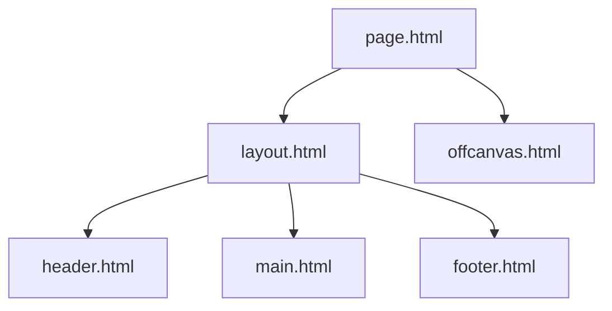

# アプリケーションデザインガイドライン

---

## 1. デザイントークン

画面上のレイアウトやUIコンポーネント、テキストなどは定義されたデザイントークンに基づいてスタイルが適用されるものとする。
デザイントークンを導入することで、UIデザインに一貫性をもたせ、クオリティコントロールとデザインの調整時に柔軟性を持たせることを目的とする。

### 1.1. デザイントークンファイル一覧

1. カラースキーム
  - 用途: デザインテーマやアプリケーションのステータスを示す配色を定義
  - ファイルパス: `frontend/_design-tokens/color-scheme.yaml`
2. サイズスケール
  - 用途: 要素の幅やサイズ、余白などのサイズを定義
  - ファイルパス: `frontend/_design-tokens/size-scale.yaml`
3. タイポグラフィ
  - 用途: 書体や文字サイズ、ウエイトなどのフォントスタイルを定義
  - ファイルパス: `frontend/_design-tokens/typography.yaml`
4. グリッドシステム
  - 用途: コンテンツ幅やグリッドレイアウトのグリッド数、余白などを定義
  - ファイルパス: `frontend/_design-tokens/grid-system.yaml`
5. ドロップシャドウ
  - 用途: 要素のドロップシャドウの色やオフセットなどを定義
  - ファイルパス: `frontend/_design-tokens/dropshadow.yaml`
6. コーナースタイル
  - 用途: 要素の角の丸みやコーナーの形状を定義
  - ファイルパス: `frontend/_design-tokens/corner-style.yaml`
7. イージング
  - 用途: アニメーションのイージングを定義
  - ファイルパス: `frontend/_design-tokens/easing.yaml`

### 1.2. デザイントークン例

```yaml
# frontend/_design-tokens/color-scheme.yaml
token-name: color-scheme
token-value:
  palette-color:
    - id: red
      name: 赤
      color-scale:
        tone0: "#FEE2E2"
        tone1: "#FECACA"
        tone2: "#FCA5A5"
        tone3: "#F87171"
        tone4: "#EF4444"
        tone5: "#DC2626"
        tone6: "#B91C1C"
        tone7: "#991B1B"
        tone8: "#7F1D1D"
        tone9: "#450A0A"

# frontend/_design-tokens/size-scale.yaml
token-name: size-scale
token-value:
  absolute-size:
    6s: { px: 2, rem: 0.125 }
    5s: { px: 4, rem: 0.25 }
    4s: { px: 8, rem: 0.5 }
```

---

## 2. テーマ

アプリケーションやウェブサイトの世界観やブランドイメージを表現するために必要となる、配色やフォントなどをデザインのテーマとして定義します。
基本的にはデザイントークンで定義されているものを目的に合わせて選定します。固有のテーマを定めることでデザインに独自性を持たせることができます。

### 2.1. テーマカラー

テーマカラーはテーマにあわせて定義される配色で、デザイントークンとは別に定義されるものとし、ベースカラー、プライマリーカラー、セカンダリーカラー、アクセントカラーの4軸で配色を定義する。
基本的には、`frontend/_design-tokens/theme-color.yaml` に定義されているカラースキームを使用することとする。
テーマカラーの指定がない場合、デフォルトではベースカラー、プライマリーカラー、セカンダリーカラー、アクセントカラーを以下のように定義する。

- ベースカラー:
  - ID: `base`
  - カラースキーム: `gray-color` 
  - カラー名: `gray-cool` 
  - トーン: `tone0` から `tone9` 
- プライマリーカラー:
  - ID: `primary`
  - カラースキーム: `palette-color`
  - カラー名: `blue-violet`
  - トーン: `tone0` から `tone9`
- セカンダリーカラー:
  - ID: `secondary`
  - カラースキーム: `palette-color`
  - カラー名: `light-blue`
  - トーン: `tone0` から `tone9`
- アクセントカラー:
  - ID: `accent`
  - カラースキーム: `palette-color`
  - カラー名: `orange-yellow`
  - トーン名: `tone0` から `tone9`

---

## 3. 画面レイアウト

新規作成する際の画面レイアウトは、`frontend/_ui/page.html` のHTML構造をベースに、下記のテンプレート用HTMLファイルの内容に沿って配置したものを基本とする。
なお、以下のリストのネスト構造は、実際にコーディングを行うHTMLのネスト構造に対応するものとする。

- head要素
  - 共通メタ情報: `frontend/_ui/head/head.html`
  - 画面固有メタ情報: `frontend/_ui/head/meta.html`
- body要素
  - レイアウトコンテナー: `frontend/_ui/layouts/layout.html`
    - ヘッダーコンポーネント: `frontend/_ui/components/header.html`
    - コンテンツコンポーネント: `frontend/_ui/components/main.html`
    - フッターコンポーネント: `frontend/_ui/components/footer.html`
  - オフキャンバスコンポーネント: `frontend/_ui/components/offcanvas.html`

上記で記載されている各種HTMLテンプレートファイルは、指示がない限りすべて使用するものとし、上記のHTML基本の画面レイアウトを構成するHTMLとする。

### 3.1. 基本レイアウト構造

```html
<!DOCTYPE html>
<html>
  <head>

    <!-- frontend/_ui/head/head.html -->
    <meta charset="UTF-8">

    <!-- frontend/_ui/head/meta.html -->
    <title>ページタイトル</title>

  </head>
  <body>

    <!-- frontend/_ui/layouts/layout.html -->
    <div class="l-layout">

      <!-- frontend/_ui/components/header.html -->
      <header class="l-header">...</header>
      
      <!-- frontend/_ui/components/main.html -->
      <main class="l-main">...</main>
      
      <!-- frontend/_ui/components/footer.html -->
      <footer class="l-footer">...</footer>

    </div>

    <!-- frontend/_ui/components/offcanvas.html -->
    <div class="l-offcanvas">...</div>

  </body>
</html>
```

### 3.2. コンポーネント階層構造



---

## 4. コーディング方針

### 4.1. コーディングルール 

#### 4.1.1. 基本ルール 

- HTML、CSS、JavaScriptファイルのコード内インデントは、2スペース（半角スペース2つ分）とする。
- HTMLのclass属性値は、ケバブケースで記載する。
- テンプレート用HTMLファイルは、`frontend/_ui/layouts/` あるいは `frontend/_ui/components/` ディレクトリに配置され、コードの一貫性を保つため、例外を除き基本的にはこれらのHTMLファイルの中身をそのまま使用するようにします。
- `frontend/_ui/layouts/` あるいは `frontend/_ui/components/` ディレクトリに配置されたHTMLファイルは、テンプレートとして使用される前提のフォーマットとなっており、`<!-- child components -->` というコメントが配置されている箇所に、子要素のとして別のテンプレート用HTMLファイルの中身が配置される想定とします。
- `frontend/_ui/layouts/` と `frontend/_ui/components/` と `frontend/_ui/head/` ディレクトリに配置されたHTMLファイル、ならびにベースのHTMLである `frontend/_ui/page.html` については、**直接編集を加えずに記載されたHTMLの内容をコピーし、新規作成するHTMLファイル内に書き写していく**形でコーディングを進めていきます。
- `frontend/_ui/layouts/` および `frontend/_ui/components/` ディレクトリに配置されたHTMLファイルにおいて、あらかじめ設定されたclass名は削除、変更せずに残しておくものとする。
- 新規作成するHTMLファイルは、`backend/_webroot/preview` ディレクトリ配下に配置します。

#### 4.1.2. スタイルシートに関するルール

- スタイルシートは別ファイルで管理せず、head要素内に、style要素を配置して管理し、1つのHTMLで完結させる形を基本とします。
- スタイルリセット用のCSSは、 `frontend/_ui/layouts/head/head.html` のテンプレート内に用意されているものを使用します。

#### 4.1.3. レイアウトに関するルール

- カラムレイアウトを実装する場合には、基本的にGrid Layoutを使用する。内包するアイテム要素数が可変長など、フレキシブルなレイアウト調整が求められる場合にはFlexbox Layoutで対応することもOKとする。

#### 4.1.4. デザインに関するコーディングルール

- デザイントークンで使用されている値を扱う場合には、CSS変数を利用し、効率よくスタイルを指定できるようにします。

### 4.2. CSS変数使用例

```css
:root {
  /* カラースキーム */
  --color-primary--tone-5: var(--blue-violet-tone5);
  --color-secondary--tone5: var(--light-blue-tone5);
  
  /* タイポグラフィ */
  --font-size--r: 1rem;
  --line-height--thin: 1.5;
  
  /* スペーシング */
  --space--s: 0.75rem;
}
.button-primary {
  background-color: var(--color-primary--tone-5);
  padding: var(--space--s);
}
```

### 4.3. class属性値の命名規則

| プレフィックス | 用途 | 例 | 備考 |
| --- | --- | --- | --- |
| l- | レイアウト | l-container | `/frontend/_ui/layouts/` ディレクトリ配下のテンプレートで使用 |
| c- | コンポーネント | c-button | `/frontend/_ui/components/` ディレクトリ配下のテンプレートで使用 |
| u- | ユーティリティ | u-margin-top | CSSのスタイルを適用するユーティリティ用 |
| js- | JavaScript用フック | js-modal-trigger | JavaScriptの処理内でのDOM参照用 |

---

## 5. レスポンシブデザイン

### 5.1. ブレークポイント

| 名称 | サイズ | 用途 |
| --- | --- | --- |
| mobile-s | 400px以下 | スマートフォン縦向き |
| mobile-m | 576px以下 | スマートフォン縦向き |
| mobile-l | 768px以下 | スマートフォン横向き、タブレット縦向き |
| desktop-s | 992px以下 | タブレット横向き、ラップトップ |
| desktop-m | 1280px以下 | ラップトップ、デスクトップ |
| desktop-l | 1440px以下 | ワイドデスクトップ |

### 5.2. メディアクエリ使用例

```css
@media (1280px <= width) {
  .container {
    max-width: 992px;
  }
}
```

---

## 6. アクセシビリティ

### 6.1. アクセシビリティ要件

- コントラスト比: WCAG 2.1 AAレベル（4.5:1）以上
- キーボード操作対応必須
- スクリーンリーダー対応
- 適切なARIAラベルの使用

### 6.2. アクセシビリティ対応例

```html
<button 
  class="button-primary"
  aria-label="メニューを開く"
  role="button"
>
  <span aria-hidden="true">メニュー</span>
  <i class="icon-menu"></i>
</button>
```

---

## 7. パフォーマンス

### 7.1 パフォーマンス要件

- 画像最適化
  - WebPフォーマットの使用
  - 適切なサイズ指定
- CSS最適化
  - 未使用スタイルの削除
  - Critical CSSの使用
- レンダリングパフォーマンス
  - アニメーションはtransform/opacityを優先

---

## 8. 品質チェック

### 8.1. 実装チェックリスト
- [ ] デザイントークンの正しい使用
- [ ] レスポンシブ対応の確認
- [ ] クロスブラウザ互換性
- [ ] アクセシビリティ要件の充足
- [ ] パフォーマンス最適化
