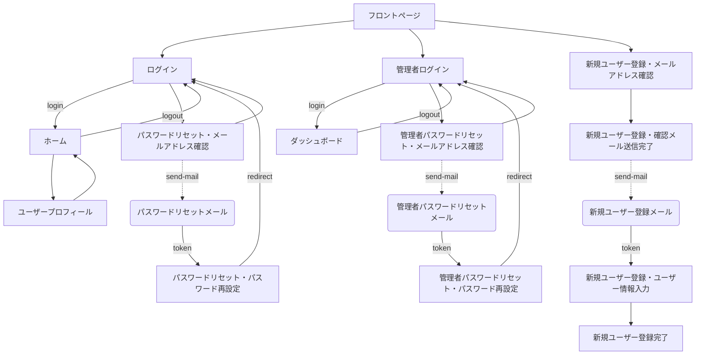
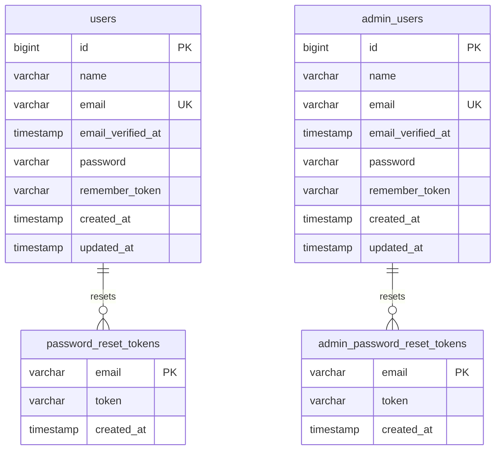

# アプリケーション概要

---

## アプリケーション画面一覧

| ID | 画面名 | 画面説明 |
| --- | --- | --- |
| frontpage | フロントページ | アプリケーションのトップ画面 |
| signin | ログイン | 一般ユーザーのログイン画面 |
| home | ホーム | 一般ユーザーログイン認証後のトップ画面 |
| admin | 管理者ログイン | 管理者ユーザーのログイン画面 |
| dashboard | ダッシュボード | 管理者ユーザーログイン認証後のダッシュボード画面 |
| password-forgot | パスワードリセット・メールアドレス確認 | 一般ユーザーのパスワードリセット時のメールアドレス確認画面 |
| password-reset | パスワードリセット・パスワード再設定 | 一般ユーザーのパスワードリセット時のパスワード再設定画面 |
| admin-password-forgot | 管理者パスワードリセット・メールアドレス確認 | 管理者ユーザーのパスワードリセット時のメールアドレス確認画面 |
| admin-password-reset | 管理者パスワードリセット・パスワード再設定 | 管理者ユーザーのパスワードリセット時のパスワード再設定画面 |
| signup | 新規ユーザー登録・メールアドレス確認 | 新規ユーザー登録時の確認用メールアドレス入力画面 |
| signup-pending | 新規ユーザー登録・確認メール送信完了 | 新規ユーザー登録時の確認用メールの送信完了画面 |
| signup-register | 新規ユーザー登録・ユーザー情報入力 | 新規ユーザー登録時のユーザー情報入力フォーム画面 |
| signup-complete | 新規ユーザー登録完了 | 新規ユーザーの登録完了画面 |
| profile | ユーザープロフィール | ユーザー情報の表示画面 |

---

## アプリケーションメールテンプレート一覧

| ID | メール名 | メール説明 |
| --- | --- | --- |
| mail-password-forgot | パスワードリセットメール | 一般ユーザーのパスワードリセット時に送信されるトークン付きリンクが記載されたメール |
| mail-admin-password-forgot | 管理者パスワードリセットメール | 管理者ユーザーのパスワードリセット時に送信されるトークン付きリンクが記載されたメール |
| mail-signup | 新規ユーザー登録メール | 新規ユーザー登録時に送信される確認用メール |

---

## アプリケーション画面構成・遷移図

---

## データベース

### テーブル一覧

| ID | テーブル名 | テーブル説明 |
| --- | --- | --- |
| users | ユーザー | 一般ユーザー情報のテーブル |
| admin_users | 管理者ユーザー | 管理者ユーザー情報のテーブル |
| password_reset_tokens | パスワードリセットトークン | 一般ユーザーのパスワードリセットトークン情報のテーブル |
| admin_password_reset_tokens | 管理者パスワードリセットトークン | 管理者ユーザーのパスワードリセットトークン情報のテーブル |

### テーブル定義

