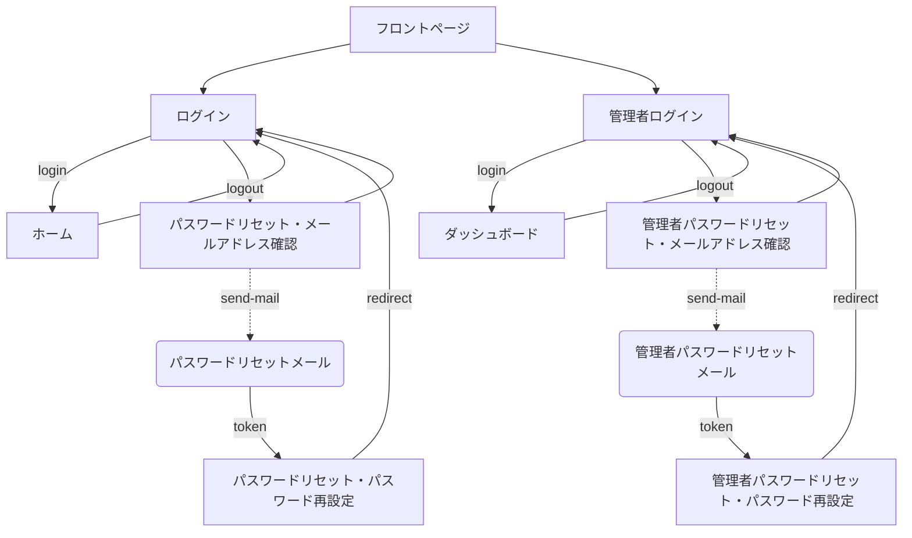
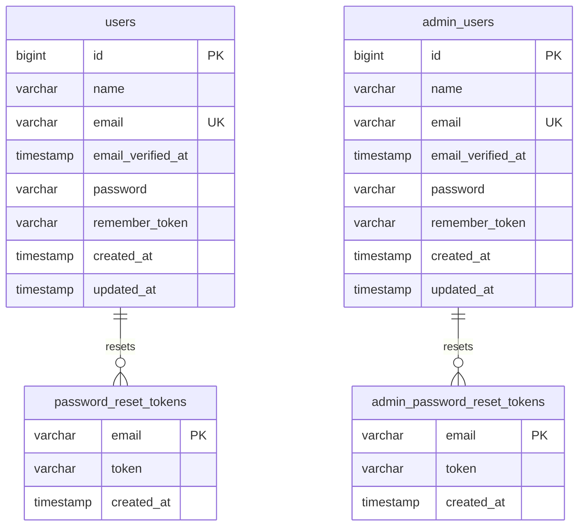

# 開発環境概要

---

## ディレクトリ構成

開発環境は以下のディレクトリ構造にしたがって実装を進めていくものとする

```
/                                      # 開発環境ルート
├── backend/                             # バックエンド（appコンテナの/var/www/htmlマウントポイント）
│   ├── laravel/                           # Laravelルートディレクトリ
│   ├── wordpress/                         # WordPressルートディレクトリ
│   └── _webroot/                            # サーバードキュメントルート（webコンテナのドキュメントルート）
│       ├── testing-app.php                  # PHP情報表示用ファイル
│       ├── testing-smtp.php                 # メール送信テスト用ファイル
│       ├── index.php                        # バックエンドアプリケーションエントリーポイントファイル
│       └── storage                          # ストレージ用シンボリックリンク
├── frontend/                            # フロントエンド
│   ├── next/                              # Next.jsプロジェクトルートディレクトリ
│   ├── nuxt/                              # Nuxt.jsプロジェクトルートディレクトリ
│   ├── astro/                             # Astroプロジェクトルートディレクトリ
│   ├── vite/                              # Viteプロジェクトルートディレクトリ
│   └── react-native/                      # ReactNativeプロジェクトルートディレクトリ
├── server/                              # サーバー
│   ├── docker/                            # Docker環境
│   │   ├── mailpit/                         # メーラー
│   │   │   └── Dockerfile                   # メーラー用Dockerfile
│   │   ├── mysql/                           # データベース
│   │   │   ├── Dockerfile                   # データベース用Dockerfile
│   │   │   └── my.cnf                       # データベース用設定ファイル
│   │   ├── nginx/                           # ウェブサーバー
│   │   │   ├── Dockerfile                   # ウェブサーバー用Dockerfile
│   │   │   └── nginx.conf                   # ウェブサーバー用設定ファイル
│   │   └── php/                             # プログラミング言語
│   │       ├── Dockerfile                   # PHP用Dockerfile
│   │       └── php.ini                      # PHP用設定ファイル
│   ├── docker-compose.yml                 # Docker Composeファイル
│   ├── .env                               # Docker環境変数
│   └── Makefile                           # Makeコマンドファイル
└── SPECIFICATIONS/                      # プロジェクト仕様書
    ├── ENV_OVERVIEW.md                    # 開発環境概要
    ├── ENV_PROCEDURES.md                  # 開発環境構築手順
    └── DEV_BACKEND.md                     # バックエンド実装

```

---

## アプリケーション画面一覧

開発するアプリケーションの画面一覧を以下に示す

| ID | 画面名 | 画面説明 |
| --- | --- | --- |
| frontpage | フロントページ | アプリケーションのトップ画面 |
| signin | ログイン | 一般ユーザーのログイン画面 |
| home | ホーム | 一般ユーザーログイン認証後のトップ画面 |
| admin | 管理者ログイン | 管理者ユーザーのログイン画面 |
| dashboard | ダッシュボード | 管理者ユーザーログイン認証後のダッシュボード画面 |
| password-forgot | パスワードリセット・メールアドレス確認 | 一般ユーザーのパスワードリセット時のメールアドレス確認画面 |
| password-reset | パスワードリセット・パスワード再設定 | 一般ユーザーのパスワードリセット時のパスワード再設定画面 |
| admin-password-forgot | 管理者パスワードリセット・メールアドレス確認 | 管理者ユーザーのパスワードリセット時のメールアドレス確認画面 |
| admin-password-reset | 管理者パスワードリセット・パスワード再設定 | 管理者ユーザーのパスワードリセット時のパスワード再設定画面 |

開発するアプリケーションで扱うメールの一覧を以下に示す

| ID | メール名 | メール説明 |
| --- | --- | --- |
| mail-password-forgot | パスワードリセットメール | 一般ユーザーのパスワードリセット時に送信されるトークン付きリンクが記載されたメール |
| mail-admin-password-forgot | 管理者パスワードリセットメール | 管理者ユーザーのパスワードリセット時に送信されるトークン付きリンクが記載されたメール |

---

## アプリケーション画面構成図

開発するアプリケーションの画面構成ならびに遷移を表した図を以下に示す



---

## データベース定義

### テーブル一覧

開発するアプリケーションで使用するデータベースのテーブル一覧を以下に示す

| ID | テーブル名 | テーブル説明 |
| --- | --- | --- |
| users | ユーザー | 一般ユーザー情報のテーブル |
| admin_users | 管理者ユーザー | 管理者ユーザー情報のテーブル |
| password_reset_tokens | パスワードリセットトークン | 一般ユーザーのパスワードリセットトークン情報のテーブル |
| admin_password_reset_tokens | 管理者パスワードリセットトークン | 管理者ユーザーのパスワードリセットトークン情報のテーブル |

### テーブル定義

開発するアプリケーションで使用するデータベースのテーブル定義を以下に示す


