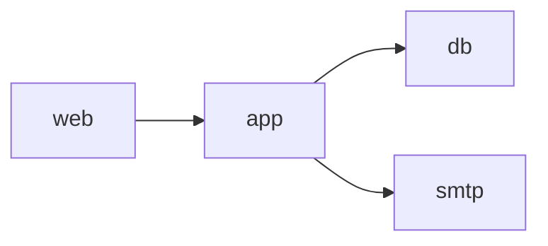

# 開発環境概要

---

## ディレクトリ

### ディレクトリ構成

開発環境は以下のファイル・ディレクトリ構造にしたがって実装を進めていくものとする。

```
/                                      # 開発環境ルート
├── backend/                             # バックエンド（appコンテナの/var/www/htmlマウントポイント）
│   ├── _webroot/                          # 開発環境ローカルサーバードキュメントルート（webコンテナのドキュメントルート）
│   │   ├── preview                          # プレビューテストディレクトリ
│   │   ├── testing-app.php                  # PHP情報表示確認用ファイル
│   │   ├── testing-smtp.php                 # メール送受信テスト用ファイル
│   │   ├── index.php                        # バックエンドアプリケーションエントリーポイントファイル
│   │   └── storage                          # バックエンドファイルストレージシンボリックリンク
│   ├── laravel/                           # Laravelプロジェクトルート
│   └── wordpress/                         # WordPressプロジェクトルート
├── frontend/                            # フロントエンド
│   ├── _design-tokens/                    # デザイントークン
│   │   ├── color-scheme.yaml                # 配色用
│   │   ├── size-scale.yaml                  # サイズ指定
│   │   ├── typography.yaml                  # タイポグラフィ
│   │   ├── grid-system.yaml                 # グリッドシステム
│   │   ├── dropshadow.yaml                  # ドロップシャドウ
│   │   ├── corner-style.yaml                # コーナースタイル
│   │   └── easing.yaml                      # イージング
│   ├── _ui/                               # UIコンポーネントHTMLテンプレート
│   │   ├── components/                      # コンポーネント要素テンプレート
│   │   ├── head/                            # head要素テンプレート
│   │   ├── layouts/                         # レイアウト要素テンプレート
│   │   └── page.html                        # ページテンプレート
│   ├── next/                              # Next.jsプロジェクトルート
│   ├── nuxt/                              # Nuxt.jsプロジェクトルート
│   ├── astro/                             # Astroプロジェクトルート
│   ├── vite/                              # Viteプロジェクトルート
│   └── react-native/                      # ReactNativeプロジェクトルート
├── server/                              # サーバー
│   ├── docker/                            # Docker環境
│   │   ├── mailpit/                         # SMTPサーバー
│   │   │   └── Dockerfile                   # SMTPサーバーDockerfile
│   │   ├── mysql/                           # データベースサーバー
│   │   │   ├── Dockerfile                   # データベースサーバーDockerfile
│   │   │   └── my.cnf                       # データベースサーバー設定ファイル
│   │   ├── nginx/                           # ウェブサーバー
│   │   │   ├── Dockerfile                   # ウェブサーバーDockerfile
│   │   │   └── nginx.conf                   # ウェブサーバー設定ファイル
│   │   └── php/                             # プログラミング言語
│   │       ├── Dockerfile                   # PHPDockerfile
│   │       └── php.ini                      # PHP設定ファイル
│   ├── docker-compose.yml                 # Docker Composeファイル
│   ├── .env                               # Docker環境変数
│   └── Makefile                           # Makeコマンドファイル
├── SPECIFICATIONS/                      # 仕様書
│   ├── ENV_OVERVIEW.md                    # 開発環境概要
│   ├── ENV_PROCEDURES.md                  # 開発環境構築手順
│   ├── APP_OVERVIEW.md                    # アプリケーション概要
│   ├── APP_DESIGN.md                      # アプリケーションデザインガイドライン
│   ├── DEV_BACKEND_RULES.md               # バックエンド実装ルール
│   └── DEV_BACKEND_TASKS.md               # バックエンド実装タスクリスト
├── README.md                            # 概要説明
├── .gitignore                           # Git設定
└── .cursorrules                         # Cursor設定
```

### 主要ディレクトリ詳細説明

1. `/backend/`
   - 用途: バックエンドアプリケーションのソースコード、およびwebコンテナードキュメントルート
   - 主要フレームワーク
     - **Laravel**: ウェブアプリケーション
     - **WordPress**: CMS
2. `/frontend/`
   - 用途: フロントエンドアプリケーションのソースコード、UIデザイン用コンポーネント、デザイントークン
   - 主要フレームワーク
     - **Next.js**: フロントエンドアプリケーション
     - **Nuxt.js**: フロントエンドアプリケーション
     - **Astro**: 静的サイトジェネレーター
     - **Vite**: フロントエンドビルドツール
     - **React Native**: モバイルアプリケーションフレームワーク
   - デザイントークン
     - **color-scheme**: 配色
     - **size-scale**: サイズ
     - **typography**: テキスト
     - **grid-system**: レイアウト
     - **dropshadow**: ドロップシャドウ
     - **corner-style**: コーナースタイル
     - **easing**: イージング
3. `/server/`
   - 用途: Docker環境構築用ファイル
   - コンテナー
     - **web**: ウェブサーバーコンテナー / `Nginx` イメージを使用
     - **app**: プログラミング言語コンテナー / `PHP` イメージを使用
     - **db**: データベースサーバーコンテナー / `MariaDB` イメージを使用
     - **smtp**: SMTPサーバーコンテナー / `mailpit` イメージを使用
4. `/SPECIFICATIONS/` 
    - 用途: AI駆動開発用の各種ドキュメント、仕様書
    - 主なドキュメント
      - `/SPECIFICATIONS/ENV_OVERVIEW.md`: 開発環境概要
      - `/SPECIFICATIONS/ENV_PROCEDURES.md`: 開発環境構築手順
      - `/SPECIFICATIONS/DEV_BACKEND.md`: バックエンド実装タスクリスト
      - `/SPECIFICATIONS/APP_DESIGN.md`: UIデザインコーディング仕様書

---

## Docker環境

### Docker環境変数

- 環境変数ファイルパス: `/server/.env`

| 変数名 | 説明 | デフォルト値 |
| --- | --- | --- |
| COMPOSE_PROJECT_NAME | Docker Compose プロジェクト名 | startify-app |
| APP_NAME | アプリケーション名 | startify-app |
| DB_HOST | データベースサーバーホスト名 | localhost |
| DB_PORT | データベースサーバーポート番号 | 3306 |
| DB_DATABASE | アプリケーション用データベース名 | master |
| DB_DATABASE | アプリケーション用データベースユーザー名 | admin |
| DB_PASSWORD | アプリケーション用データベースパスワード | secret |
| CMS_DATABASE | CMS用データベース名 | cms |
| CMS_USERNAME | CMS用データベースユーザー名 | admin |
| CMS_USERNAME | CMS用データベースパスワード | password |
| CMS_EMAIL | CMS用管理者ユーザーメールアドレス | admin@example.com |

### コンテナー依存関係



---

## トラブルシューティング・検証

### 一般的な問題と解決方法

1. コンテナー起動失敗
   - 症状: docker-compose up実行時にエラー
   - 解決: ポート競合の確認、既存コンテナーの停止
2. データベース接続エラー
   - 症状: アプリケーションがデータベースに接続できない
   - 解決: 環境変数の確認、ネットワーク設定の確認

### 環境検証項目
- [ ] Dockerコンテナーが正常に起動するか
- [ ] データベース接続が確立できるか
- [ ] メール送信機能が動作するか
- [ ] フロントエンド開発サーバーが起動するか

---
