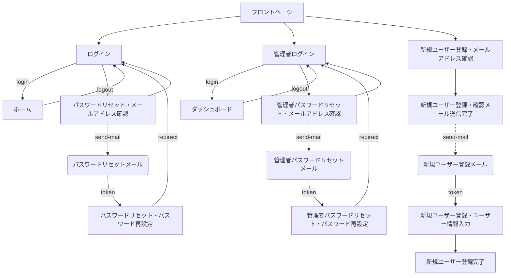

# 開発環境概要

---

## ディレクトリ構成

開発環境は以下のファイル・ディレクトリ構造にしたがって実装を進めていくものとする

```
/                                      # 開発環境ルート
├── backend/                             # バックエンド（appコンテナの/var/www/htmlマウントポイント）
│   ├── _webroot/                          # 開発環境ローカルサーバードキュメントルート（webコンテナのドキュメントルート）
│   │   ├── testing-app.php                  # PHP情報表示用ファイル
│   │   ├── testing-smtp.php                 # メール送信テスト用ファイル
│   │   ├── index.php                        # バックエンドアプリケーションエントリーポイントファイル
│   │   └── storage                          # バックエンドファイルストレージ用シンボリックリンク
│   ├── laravel/                           # Laravelルートディレクトリ
│   └── wordpress/                         # WordPressルートディレクトリ
├── frontend/                            # フロントエンド
│   ├── _design-tokens/                    # UIデザイン用デザイントークン
│   │   ├── color-scheme.yaml                # 配色用
│   │   ├── size-scale.yaml                  # サイズ指定
│   │   ├── typography.yaml                  # タイポグラフィ
│   │   ├── grid-system.yaml                 # グリッドシステム
│   │   ├── dropshadow.yaml                  # ドロップシャドウ
│   │   ├── corner-style.yaml                # コーナースタイル
│   │   └── easing.yaml                      # イージング
│   ├── _ui/                               # UIコンポーネント用ディレクトリ
│   │   ├── components/                      # コンポーネント要素テンプレートHTML
│   │   ├── head/                            # head要素テンプレートHTML
│   │   ├── layouts/                         # レイアウト要素テンプレートHTML
│   │   └── ui.html                          # UIデザイン用サンプルHTMLファイル
│   ├── _projects/                         # 静的コーディングプロジェクト用ディレクトリ
│   ├── next/                              # Next.jsプロジェクトルートディレクトリ
│   ├── nuxt/                              # Nuxt.jsプロジェクトルートディレクトリ
│   ├── astro/                             # Astroプロジェクトルートディレクトリ
│   ├── vite/                              # Viteプロジェクトルートディレクトリ
│   └── react-native/                      # ReactNativeプロジェクトルートディレクトリ
├── server/                              # サーバー
│   ├── docker/                            # Docker環境
│   │   ├── mailpit/                         # メーラー
│   │   │   └── Dockerfile                   # メーラー用Dockerfile
│   │   ├── mysql/                           # データベース
│   │   │   ├── Dockerfile                   # データベース用Dockerfile
│   │   │   └── my.cnf                       # データベース用設定ファイル
│   │   ├── nginx/                           # ウェブサーバー
│   │   │   ├── Dockerfile                   # ウェブサーバー用Dockerfile
│   │   │   └── nginx.conf                   # ウェブサーバー用設定ファイル
│   │   └── php/                             # プログラミング言語
│   │       ├── Dockerfile                   # PHP用Dockerfile
│   │       └── php.ini                      # PHP用設定ファイル
│   ├── docker-compose.yml                 # Docker Composeファイル
│   ├── .env                               # Docker環境変数
│   └── Makefile                           # Makeコマンドファイル
├── SPECIFICATIONS/                      # 仕様書
│   ├── ENV_OVERVIEW.md                    # 開発環境概要
│   ├── ENV_PROCEDURES.md                  # 開発環境構築手順
│   ├── DEV_BACKEND.md                     # バックエンド実装
│   ├── DESIGN_TOKENS.md                   # デザイントークン仕様書
│   └── DESIGN_UI.md                       # UIデザイン仕様書
├── README.md                            # 概要説明
├── .gitignore                           # Git設定
└── .cursorrules                         # Cursor設定
```

---

## アプリケーション画面一覧

開発するアプリケーションの画面一覧を以下に示す

| ID | 画面名 | 画面説明 |
| --- | --- | --- |
| frontpage | フロントページ | アプリケーションのトップ画面 |
| signin | ログイン | 一般ユーザーのログイン画面 |
| home | ホーム | 一般ユーザーログイン認証後のトップ画面 |
| admin | 管理者ログイン | 管理者ユーザーのログイン画面 |
| dashboard | ダッシュボード | 管理者ユーザーログイン認証後のダッシュボード画面 |
| password-forgot | パスワードリセット・メールアドレス確認 | 一般ユーザーのパスワードリセット時のメールアドレス確認画面 |
| password-reset | パスワードリセット・パスワード再設定 | 一般ユーザーのパスワードリセット時のパスワード再設定画面 |
| admin-password-forgot | 管理者パスワードリセット・メールアドレス確認 | 管理者ユーザーのパスワードリセット時のメールアドレス確認画面 |
| admin-password-reset | 管理者パスワードリセット・パスワード再設定 | 管理者ユーザーのパスワードリセット時のパスワード再設定画面 |
| signup | 新規ユーザー登録・メールアドレス確認 | 新規ユーザー登録時の確認用メールアドレス入力画面 |
| signup-pending | 新規ユーザー登録・確認メール送信完了 | 新規ユーザー登録時の確認用メールの送信完了画面 |
| signup-register | 新規ユーザー登録・ユーザー情報入力 | 新規ユーザー登録時のユーザー情報入力フォーム画面 |
| signup-complete | 新規ユーザー登録完了 | 新規ユーザーの登録完了画面 |

開発するアプリケーションで扱うメールの一覧を以下に示す

| ID | メール名 | メール説明 |
| --- | --- | --- |
| mail-password-forgot | パスワードリセットメール | 一般ユーザーのパスワードリセット時に送信されるトークン付きリンクが記載されたメール |
| mail-admin-password-forgot | 管理者パスワードリセットメール | 管理者ユーザーのパスワードリセット時に送信されるトークン付きリンクが記載されたメール |
| mail-signup | 新規ユーザー登録メール | 新規ユーザー登録時に送信される確認用メール |
---

## アプリケーション画面構成図

開発するアプリケーションの画面構成ならびに遷移を表した図を以下に示す



---

## データベース定義

### テーブル一覧

開発するアプリケーションで使用するデータベースのテーブル一覧を以下に示す

| ID | テーブル名 | テーブル説明 |
| --- | --- | --- |
| users | ユーザー | 一般ユーザー情報のテーブル |
| admin_users | 管理者ユーザー | 管理者ユーザー情報のテーブル |
| password_reset_tokens | パスワードリセットトークン | 一般ユーザーのパスワードリセットトークン情報のテーブル |
| admin_password_reset_tokens | 管理者パスワードリセットトークン | 管理者ユーザーのパスワードリセットトークン情報のテーブル |

### テーブル定義

開発するアプリケーションで使用するデータベースのテーブル定義を以下に示す


