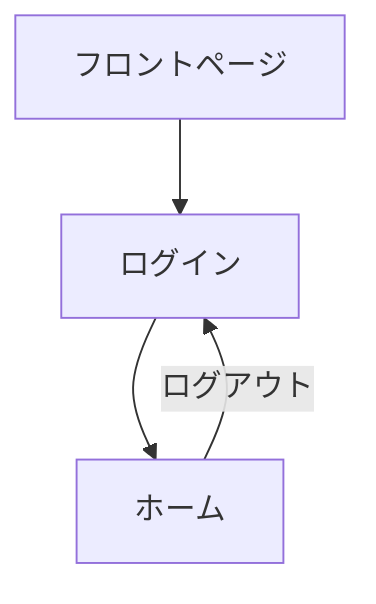

# プロジェクト概要

---

## ディレクトリ構成

プロジェクトは以下のディレクトリ構造にしたがって実装を進めていくものとする

```
/                                        # プロジェクトルート  
├── backend/                             # バックエンド（appコンテナの/var/www/htmlマウントポイント）
│   ├── laravel/                           # Laravelルートディレクトリ
│   ├── wordpress/                         # WordPressルートディレクトリ
│   └── _webroot/                            # サーバードキュメントルート（webコンテナのドキュメントルート）
│       ├── testing-app.php                  # PHP情報表示用ファイル
│       ├── testing-smtp.php                 # メール送信テスト用ファイル
│       ├── index.php                        # バックエンドアプリケーションエントリーポイントファイル
│       └── storage                          # ストレージ用シンボリックリンク
├── frontend/                            # フロントエンド
│   ├── next/                              # Next.jsプロジェクトルートディレクトリ
│   ├── nuxt/                              # Nuxt.jsプロジェクトルートディレクトリ
│   ├── astro/                             # Astroプロジェクトルートディレクトリ
│   └── vite/                              # Viteプロジェクトルートディレクトリ
├── server/                              # サーバー
│   ├── docker/                            # Docker環境
│   │   ├── mailpit/                         # メーラー
│   │   │   └── Dockerfile                   # メーラー用Dockerfile
│   │   ├── mysql/                           # データベース
│   │   │   ├── Dockerfile                   # データベース用Dockerfile
│   │   │   └── my.cnf                       # データベース用設定ファイル
│   │   ├── nginx/                           # ウェブサーバー
│   │   │   ├── Dockerfile                   # ウェブサーバー用Dockerfile
│   │   │   └── nginx.conf                   # ウェブサーバー用設定ファイル
│   │   └── php/                             # プログラミング言語
│   │       ├── Dockerfile                   # PHP用Dockerfile
│   │       └── php.ini                      # PHP用設定ファイル
│   ├── docker-compose.yml                 # Docker Composeファイル
│   ├── .env                               # Docker環境変数
│   └── Makefile                           # Makeコマンドファイル
└── SPECIFICATIONS/                      # プロジェクト仕様書
    ├── ENV_PROCEDURES.md                  # 開発環境構築手順
    ├── DEV_BACKEND.md                     # バックエンド実装
    └── PROJECT_OVERVIEW.md                # プロジェクト概要
```

---

## アプリケーション画面一覧

開発するアプリケーションの画面一覧を以下に示す

| ID | 画面名 | 画面説明 |
| --- | --- | --- |
| frontpage | フロントページ | アプリケーションのトップ画面 |
| signin | ログイン | ログイン画面 |
| home | ホーム | ログイン認証後のトップ画面 |


---

## アプリケーション画面構成図

開発するアプリケーションの画面構成図を以下に示す


