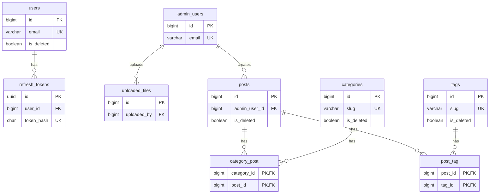

# Laravelアプリケーション データベース仕様

Startify-AppのLaravelアプリケーションが使用する現在のテーブル、制約、Relation、論理削除とSeederを定義します。

物理Schemaは `backend/laravel/database/migrations/` を正本とし、本書は現在のDB設計と運用方針の正本とします。ローカルMariaDBはMigration適用結果の確認対象です。カラムや制約を変更するときはMigrationを追加し、本書と関連するModel・機能仕様を併せて更新します。

## 1. データベース構成

現在のローカルDocker環境ではMariaDB 11.0.6が動作し、Imageは `server/docker/mysql/Dockerfile` の `mariadb:11.0` から構築します。Laravelの接続、Session、Cache、Queueは環境変数により設定し、`backend/laravel/.env.example` では次を使用します。

| 設定 | 値 |
| --- | --- |
| DB Connection | `DB_CONNECTION=mysql` |
| Session | `SESSION_DRIVER=database` |
| Cache | `CACHE_STORE=database` |
| Queue | `QUEUE_CONNECTION=database` |

環境固有のHost、Database名、Username、Passwordは環境変数で管理し、本書には固定しません。

## 2. テーブル一覧

### 2.1 アプリケーション固有テーブル

| Table | 用途 | 対応Model |
| --- | --- | --- |
| `users` | 一般ユーザーと独自論理削除状態 | `User` |
| `admin_users` | 管理者ユーザー | `AdminUser` |
| `admin_password_reset_tokens` | 管理者のパスワード再設定Token | Password Brokerが使用 |
| `uploaded_files` | アップロードファイルのMetadata | `UploadedFile` |
| `refresh_tokens` | 独自JWT認証のRefresh Token | `RefreshToken` |
| `posts` | 投稿本文、投稿者名、公開日時、論理削除状態 | `Post` |
| `categories` | 投稿カテゴリと論理削除状態 | `Category` |
| `tags` | 投稿タグと論理削除状態 | `Tag` |
| `category_post` | 投稿とカテゴリの中間テーブル | `Post` / `Category` Relation |
| `post_tag` | 投稿とタグの中間テーブル | `Post` / `Tag` Relation |

### 2.2 Laravel基盤テーブル

| Table | 用途 | 使用条件・設定 |
| --- | --- | --- |
| `migrations` | 適用済みMigrationとBatchの管理 | Laravelが自動管理 |
| `password_reset_tokens` | 一般ユーザーのパスワード再設定Token | `config/auth.php` の `users` Broker |
| `sessions` | Database Session | `SESSION_DRIVER=database` |
| `cache` | Database Cache | `CACHE_STORE=database` |
| `cache_locks` | Database Cache Lock | Database Cache Store |
| `jobs` | Queue待機Job | `QUEUE_CONNECTION=database` |
| `job_batches` | Batch Jobの進行状態 | Laravel Bus Batch |
| `failed_jobs` | 失敗したQueue Job | Database Failed Job Provider |

### 2.3 Sanctum由来テーブル

| Table | 用途 | 現在の利用状況 |
| --- | --- | --- |
| `personal_access_tokens` | Sanctum Personal Access Token | MigrationとSanctum設定は存在するが、現在の独自JWT認証では使用していない |

Sanctumの継続利用または削除は認証仕様で判断します。現在のMigrationが作成するテーブルであるため、利用有無にかかわらず本書の管理対象に含めます。

## 3. ユーザー・認証テーブル

### 3.1 `users`

| Column | Type | Null / Default | 制約・用途 |
| --- | --- | --- | --- |
| `id` | unsigned bigint | not null | Primary Key、Auto Increment |
| `name` | varchar(255) | not null | 表示名 |
| `email` | varchar(255) | not null | Unique |
| `email_verified_at` | timestamp | nullable | メール確認日時 |
| `password` | varchar(255) | not null | Hash化済みPassword |
| `remember_token` | varchar(100) | nullable | Remember Token |
| `is_deleted` | boolean | not null / `false` | 独自論理削除Flag、Index |
| `deleted_at` | timestamp | nullable | 独自論理削除日時 |
| `created_at` | timestamp | nullable | 作成日時 |
| `updated_at` | timestamp | nullable | 更新日時 |

### 3.2 `admin_users`

| Column | Type | Null / Default | 制約・用途 |
| --- | --- | --- | --- |
| `id` | unsigned bigint | not null | Primary Key、Auto Increment |
| `name` | varchar(255) | not null | 表示名 |
| `email` | varchar(255) | not null | Unique |
| `email_verified_at` | timestamp | nullable | メール確認日時 |
| `password` | varchar(255) | not null | Hash化済みPassword |
| `remember_token` | varchar(100) | nullable | Remember Token |
| `created_at` | timestamp | nullable | 作成日時 |
| `updated_at` | timestamp | nullable | 更新日時 |

### 3.3 パスワード再設定Token

`password_reset_tokens` と `admin_password_reset_tokens` は同じSchemaを持ちます。

| Column | Type | Null / Default | 制約・用途 |
| --- | --- | --- | --- |
| `email` | varchar(255) | not null | Primary Key |
| `token` | varchar(255) | not null | Hash化された再設定Token |
| `created_at` | timestamp | nullable | 発行日時 |

一般ユーザーは `password_reset_tokens`、管理者は `admin_password_reset_tokens` を使用します。いずれもユーザーテーブルへの物理外部キーを持たず、Password Brokerがメールアドレスを使って管理します。

### 3.4 `sessions`

| Column | Type | Null / Default | 制約・用途 |
| --- | --- | --- | --- |
| `id` | varchar(255) | not null | Primary Key |
| `user_id` | unsigned bigint | nullable | 認証ユーザーID、Index、物理外部キーなし |
| `ip_address` | varchar(45) | nullable | IPv4 / IPv6 Address |
| `user_agent` | text | nullable | User Agent |
| `payload` | longtext | not null | Session Payload |
| `last_activity` | int | not null | 最終活動時刻、Index |

一般ユーザーと管理者は同じDatabase Session Storeを利用します。ただし、`user_id` は複数Guardに対応するPolymorphic列ではありません。LaravelのDatabase Session HandlerはコンテナーへBindingされた既定GuardのIDを保存し、現在の既定Guardは `web` です。そのため、`user_id` は主に一般ユーザーIDを保持し、管理者Sessionと `admin_users` の対応を物理的に保証しません。

`user_id` はLaravel標準MigrationどおりIndexだけを持ち、`users` または `admin_users` への物理外部キーはありません。一般ユーザーと管理者のSession管理方法は認証仕様で定義します。

### 3.5 `refresh_tokens`

| Column | Type | Null / Default | 制約・用途 |
| --- | --- | --- | --- |
| `id` | char(36) | not null | UUID Primary Key |
| `user_id` | unsigned bigint | not null | `users.id` への外部キー、Index |
| `token_hash` | char(64) | not null | Token Hash、Unique |
| `ip` | varchar(45) | nullable | 発行元IPv4 / IPv6 Address |
| `ua` | text | nullable | 発行元User Agent |
| `revoked_at` | timestamp | nullable | 失効日時、Index |
| `expires_at` | timestamp | nullable | 有効期限、Index |
| `created_at` | timestamp | nullable | 作成日時 |
| `updated_at` | timestamp | nullable | 更新日時 |

`user_id` の参照先が削除された場合は、関連するRefresh TokenもCascade Deleteします。Tokenの発行、Rotation、失効、保持期間と削除Commandは認証仕様を正本とします。

### 3.6 `personal_access_tokens`

| Column | Type | Null / Default | 制約・用途 |
| --- | --- | --- | --- |
| `id` | unsigned bigint | not null | Primary Key、Auto Increment |
| `tokenable_type` | varchar(255) | not null | Polymorphic Type、複合Index |
| `tokenable_id` | unsigned bigint | not null | Polymorphic ID、複合Index |
| `name` | varchar(255) | not null | Token名 |
| `token` | varchar(64) | not null | Unique |
| `abilities` | text | nullable | 権限一覧 |
| `last_used_at` | timestamp | nullable | 最終利用日時 |
| `expires_at` | timestamp | nullable | 有効期限 |
| `created_at` | timestamp | nullable | 作成日時 |
| `updated_at` | timestamp | nullable | 更新日時 |

Polymorphicな関連を使用するため、`tokenable_id` に物理外部キーはありません。

## 4. ファイル管理テーブル

### 4.1 `uploaded_files`

| Column | Type | Null / Default | 制約・用途 |
| --- | --- | --- | --- |
| `id` | unsigned bigint | not null | Primary Key、Auto Increment |
| `filename` | varchar(255) | not null | Upload時の元ファイル名 |
| `stored_filename` | varchar(255) | not null | Storage上の保存ファイル名 |
| `file_path` | varchar(255) | not null | `uploads` Disk内のPath |
| `mime_type` | varchar(255) | not null | MIME Type |
| `file_size` | unsigned bigint | not null | Byte単位のファイルサイズ |
| `file_extension` | varchar(255) | not null | 拡張子 |
| `uploaded_by` | unsigned bigint | not null | `admin_users.id` への外部キー |
| `description` | text | nullable | 説明 |
| `created_at` | timestamp | nullable | 作成日時 |
| `updated_at` | timestamp | nullable | 更新日時 |

`uploaded_by` と `created_at` に複合Indexがあります。管理者削除時の外部キー動作はUpdate / DeleteともにRestrictです。Storage上の実体管理はファイル管理仕様を正本とします。

## 5. コンテンツ管理テーブル

### 5.1 `posts`

| Column | Type | Null / Default | 制約・用途 |
| --- | --- | --- | --- |
| `id` | unsigned bigint | not null | Primary Key、Auto Increment |
| `admin_user_id` | unsigned bigint | not null | `admin_users.id` への外部キー、Index |
| `title` | varchar(255) | not null | 投稿Title |
| `body` | text | not null | 投稿本文 |
| `author` | varchar(255) | not null | 表示用投稿者名のSnapshot |
| `published_at` | timestamp | not null | 公開日時、Index |
| `is_deleted` | boolean | not null / `false` | 独自論理削除Flag、Index |
| `deleted_at` | timestamp | nullable | 独自論理削除日時 |
| `created_at` | timestamp | nullable | 作成日時 |
| `updated_at` | timestamp | nullable | 更新日時 |

`admin_user_id` の参照先が削除された場合は、関連する投稿もCascade Deleteします。

### 5.2 `categories` / `tags`

`categories` と `tags` は同じSchemaを持ちます。

| Column | Type | Null / Default | 制約・用途 |
| --- | --- | --- | --- |
| `id` | unsigned bigint | not null | Primary Key、Auto Increment |
| `name` | varchar(255) | not null | 表示名 |
| `slug` | varchar(255) | not null | Unique |
| `is_deleted` | boolean | not null / `false` | 独自論理削除Flag、Index |
| `deleted_at` | timestamp | nullable | 独自論理削除日時 |
| `created_at` | timestamp | nullable | 作成日時 |
| `updated_at` | timestamp | nullable | 更新日時 |

### 5.3 中間テーブル

| Table | Columns | Primary Key | Foreign Keys |
| --- | --- | --- | --- |
| `category_post` | `category_id`, `post_id` | (`category_id`, `post_id`) | `category_id → categories.id`、`post_id → posts.id` |
| `post_tag` | `post_id`, `tag_id` | (`post_id`, `tag_id`) | `post_id → posts.id`、`tag_id → tags.id` |

すべての外部キーは参照先の削除時にCascade Deleteします。中間テーブルにはTimestampを持ちません。

## 6. Laravel基盤テーブル

### 6.1 MigrationとCache

| Table | Columns | 主な制約 |
| --- | --- | --- |
| `migrations` | `id`, `migration`, `batch` | `id` がAuto Increment Primary Key |
| `cache` | `key`, `value`, `expiration` | `key` がPrimary Key |
| `cache_locks` | `key`, `owner`, `expiration` | `key` がPrimary Key |

### 6.2 Queue

| Table | 主なColumns | 主な制約 |
| --- | --- | --- |
| `jobs` | `id`, `queue`, `payload`, `attempts`, `reserved_at`, `available_at`, `created_at` | `id` がPrimary Key、`queue` にIndex |
| `job_batches` | `id`, `name`, `total_jobs`, `pending_jobs`, `failed_jobs`, `failed_job_ids`, `options`, `cancelled_at`, `created_at`, `finished_at` | `id` がPrimary Key |
| `failed_jobs` | `id`, `uuid`, `connection`, `queue`, `payload`, `exception`, `failed_at` | `id` がPrimary Key、`uuid` がUnique |

これらのカラムはLaravel標準のDatabase Cache / Queue実装が管理します。アプリケーション機能から独自の意味を追加しません。

## 7. 物理Relation

次の図はMigrationで外部キー制約が定義された物理Relationだけを示します。



### 7.1 物理外部キーを持たない関連

| 関連 | 接続方法 | 理由・現在仕様 |
| --- | --- | --- |
| `users` → `password_reset_tokens` | `email` | Password Brokerが管理し、外部キーなし |
| `admin_users` → `admin_password_reset_tokens` | `email` | Admin Password Brokerが管理し、外部キーなし |
| 既定 `web` GuardのUser → `sessions` | `user_id` | Laravel標準Session SchemaはIndexだけを持ち、複数Guardとの対応を物理的に表さない |
| Tokenable Model → `personal_access_tokens` | `tokenable_type`, `tokenable_id` | Polymorphic Relationのため外部キーなし |

これらをER図へ物理Relationとして記載しません。機能上の対応は認証仕様で定義します。

## 8. Eloquent RelationとScope

| Model | Relation / Scope | 対象・条件 |
| --- | --- | --- |
| `UploadedFile` | `uploader()` | `uploaded_by` で `AdminUser` にBelongs To |
| `RefreshToken` | `user()` | `user_id` で `User` にBelongs To |
| `RefreshToken` | `active()` | 未失効かつ期限内、または有効期限なし |
| `Post` | `adminUser()` | `admin_user_id` で `AdminUser` にBelongs To |
| `Post` | `categories()` | `category_post` を使うBelongs To Many |
| `Post` | `tags()` | `post_tag` を使うBelongs To Many |
| `Category` | `posts()` | `category_post` を使うBelongs To Many |
| `Tag` | `posts()` | `post_tag` を使うBelongs To Many |
| `User` / `Post` / `Category` / `Tag` | `active()` | `is_deleted = false` |
| `User` / `Post` / `Category` / `Tag` | `onlyDeleted()` | `is_deleted = true` |

パスワード再設定Token用の2 Modelは現在のPassword Brokerから使用されておらず、型付きPropertyにより読込時にFatal Errorとなる既知課題があります。修正はGitHub Issueで管理します。

## 9. 独自論理削除

`users`、`posts`、`categories`、`tags` はLaravelの `SoftDeletes` Traitではなく、次の2カラムを明示的に更新します。

| 状態 | `is_deleted` | `deleted_at` |
| --- | --- | --- |
| 有効 | `false` | `null` |
| 削除済み | `true` | 削除日時 |

- 削除・復元はControllerが対象カラムを更新する
- Modelの `active()` と `onlyDeleted()` Scopeで状態を絞り込む
- Global Scopeは使用しないため、通常Queryが自動的に有効データだけへ限定されるわけではない
- 一般ユーザー削除時は対象UserのDatabase Sessionを削除する
- 投稿・カテゴリ・タグの中間Relationは、論理削除だけでは削除されない

画面ごとの表示・操作条件は画面・機能仕様および各機能仕様を正本とします。

## 10. Seeder

`DatabaseSeeder` は次の順序でSeederを実行します。

1. `UserSeeder`
2. `AdminUserSeeder`
3. `CategorySeeder`
4. `TagSeeder`
5. `PostSeeder`

| Seeder | 作成内容 |
| --- | --- |
| `UserSeeder` | 固定の一般ユーザー2件 |
| `AdminUserSeeder` | 固定の管理者1件 |
| `CategorySeeder` | `test-category-1` から `test-category-5` までの5件 |
| `TagSeeder` | `test-tag-1` から `test-tag-5` までの5件 |
| `PostSeeder` | 最初の管理者を投稿者とする投稿10件と、ランダムなカテゴリ・タグRelation |

現在のSeederはローカル開発用です。固定のメールアドレスとPasswordを含み、既存データを消去せず、重複実行に対する冪等性を保証しません。本番環境の初期データ投入には使用しません。

Docker環境起動後、`server/` で次を実行すると全Seederを実行します。既存DBへ重複データを追加またはUnique制約違反を発生させる可能性があるため、対象DBの状態を確認してから使用します。

```bash
make laravel-seed
```

## 11. Schema変更方針

- 適用済みMigrationを後から書き換えず、新しいMigrationで変更する
- DB固有の制約はMigrationへ明示する
- Modelの `$fillable`、`$casts`、Relation、ScopeをSchema変更と併せて確認する
- 外部キーの追加・変更時は削除時動作を明示する
- Indexは実際の検索・並び替え・結合条件を基に追加する
- Laravel基盤テーブルはFrameworkの期待するSchemaを維持する
- 開発用Seederと本番で必要な初期データを分離する
- Schemaを超える認証、コンテンツ、ファイル処理は各機能仕様へ記録する

## 12. 検証

Docker環境起動後、`server/` でMigration適用状況を確認します。

```bash
docker compose exec app bash -c "cd /var/www/html/laravel && php artisan migrate:status"
```

テーブルのカラム、Index、外部キーを確認します。

```bash
docker compose exec app bash -c "cd /var/www/html/laravel && php artisan db:table users"
```

アプリケーションテスト:

```bash
make laravel-test
```

MigrationやSeederを実行するとDBが変更されます。調査・レビューだけの場合は `migrate`、`migrate:fresh`、`db:seed` を実行しません。
