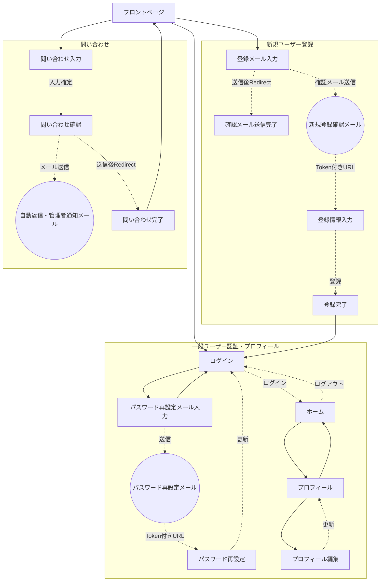
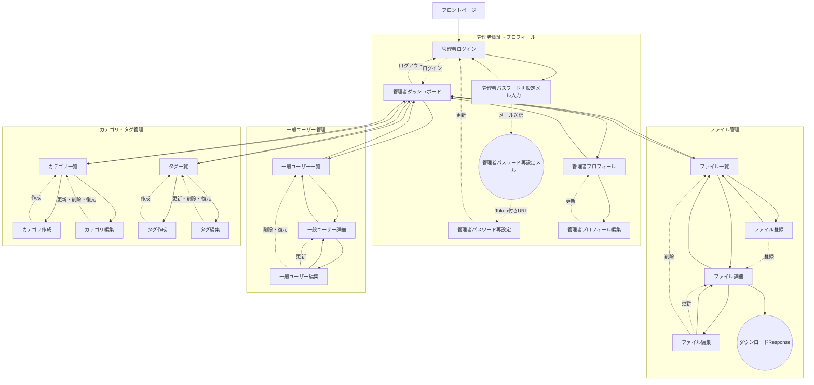
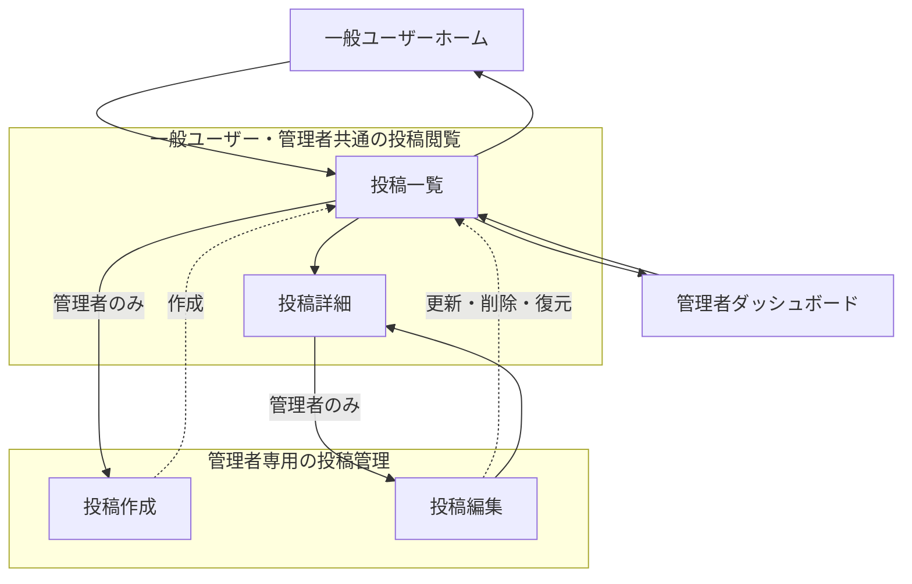

# Laravelアプリケーション 画面・機能仕様

Startify-AppのLaravel MPAが現在提供する画面、アクセス境界、画面を伴わないWeb処理と主要な画面遷移を定義します。

本書は画面と機能の索引です。各機能の入力値、処理、データ構造、メール、認証・認可条件などの詳細は、個別仕様へ順次分離します。

## 1. アクセス境界

画面とWeb処理は、`backend/laravel/routes/web.php` で次のアクセス境界に分かれています。

| 表記 | Route Middleware | 対象 |
| --- | --- | --- |
| Public | 個別指定なし | フロントページ、一般・管理者ログイン、管理者パスワード再設定、問い合わせ |
| Guest | `guest` | 一般ユーザーのパスワード再設定、新規登録 |
| User | `auth` | 一般ユーザーのホーム、プロフィール、ログアウト |
| Admin | `auth:admin` | 管理画面、管理者プロフィール、各管理機能 |
| Auth Any | `auth.any` | 一般ユーザーまたは管理者による投稿閲覧 |

管理者ログインと管理者パスワード再設定のRouteには、現在個別のMiddlewareが指定されていません。認証済みユーザーのアクセス時を含む詳細な認証・認可要件は、認証仕様で定義します。

## 2. Public画面

| 画面ID | 画面 | Method / Path | Route Name | View | 主な機能 |
| --- | --- | --- | --- | --- | --- |
| `frontpage` | フロントページ | `GET /` | `frontpage` | `pages.frontpage.index` | アプリケーションの入口、認証状態に応じたログイン・ログアウト導線 |
| `signin` | 一般ユーザーログイン | `GET /signin` | `signin` | `pages.signin.index` | メールアドレスとパスワードによるログイン入力 |
| `contact` | 問い合わせ入力 | `GET /contact` | `contact` | `pages.contact.index` | 問い合わせ内容の入力 |
| `contact-confirm` | 問い合わせ確認 | `GET /contact/confirm` | `contact.confirm` | `pages.contact.confirm` | Sessionに保存した入力内容の確認 |
| `contact-thanks` | 問い合わせ完了 | `GET /contact/thanks` | `contact.thanks` | `pages.contact.thanks` | メール送信完了の表示 |

問い合わせ確認と完了画面は、必要なSession状態がない場合に問い合わせ入力画面へRedirectします。

## 3. Guest画面

| 画面ID | 画面 | Method / Path | Route Name | View | 主な機能 |
| --- | --- | --- | --- | --- | --- |
| `password-forgot` | パスワード再設定メール入力 | `GET /password-forgot` | `password-forgot` | `pages.password-forgot.index` | 一般ユーザーの登録メールアドレス入力 |
| `password-reset` | パスワード再設定 | `GET /password-reset/{token}` | `password-reset` | `pages.password-reset.index` | Tokenとメールアドレスを使った新しいパスワードの入力 |
| `signup` | 新規登録メール入力 | `GET /signup` | `signup` | `pages.signup.verify` | 登録するメールアドレスの入力 |
| `signup-pending` | 新規登録メール送信完了 | `GET /signup/pending` | `signup.pending` | `pages.signup.pending` | 確認メール送信後の案内 |
| `signup-register` | 新規登録情報入力 | `GET /signup/register` | `signup.register` | `pages.signup.register` | Token確認後の名前とパスワード入力 |
| `signup-complete` | 新規登録完了 | `GET /signup/complete` | `signup.complete` | `pages.signup.complete` | ユーザー登録完了の表示 |

新規登録の各画面はSessionに保存したメールアドレスやToken確認状態を使用します。必要な状態がない場合は、新規登録メール入力画面へRedirectする画面があります。

## 4. 一般ユーザー画面

| 画面ID | 画面 | Method / Path | Route Name | View | 主な機能 |
| --- | --- | --- | --- | --- | --- |
| `home` | ホーム | `GET /home` | `home` | `pages.home.index` | ログイン中の一般ユーザー向け入口 |
| `profile` | プロフィール | `GET /profile/{id}` | `profile` | `pages.profile.index` | 一般ユーザー情報の表示 |
| `profile-edit` | プロフィール編集 | `GET /profile/{id}/edit` | `profile.edit` | `pages.profile.edit` | 一般ユーザー情報の編集 |

`GET /profile` の `profile.redirect` は画面を表示せず、ログイン中の一般ユーザーIDを含む `profile` RouteへRedirectします。現在の詳細表示は本人以外も許可し、名前だけを表示します。編集・更新では、Controllerがログイン中のユーザーとRoute Parameterの対象UserのID一致を確認します。詳細表示を含めて本人だけに制限する改善はIssue #35で管理します。

## 5. 管理者認証関連画面

| 画面ID | 画面 | Method / Path | Route Name | View | 現在の境界 | 主な機能 |
| --- | --- | --- | --- | --- | --- | --- |
| `admin` | 管理者ログイン | `GET /admin` | `admin` | `pages.admin.index` | Public | 管理者のメールアドレスとパスワード入力 |
| `admin-password-forgot` | 管理者パスワード再設定メール入力 | `GET /admin/password-forgot` | `admin.password-forgot` | `pages.admin.password-forgot.index` | Public | 管理者の登録メールアドレス入力 |
| `admin-password-reset` | 管理者パスワード再設定 | `GET /admin/password-reset/{token}` | `admin.password-reset` | `pages.admin.password-reset.index` | Public | Tokenとメールアドレスを使った新しいパスワードの入力 |

ここでのPublicはRouteに個別のMiddleware指定がないことを表し、認証機能として公開すべき範囲を確定するものではありません。

## 6. 管理画面

次の画面は `auth:admin` Middlewareの内側にあります。

### 6.1 管理者ホームとプロフィール

| 画面ID | 画面 | Method / Path | Route Name | View | 主な機能 |
| --- | --- | --- | --- | --- | --- |
| `admin-dashboard` | 管理者ダッシュボード | `GET /admin/dashboard` | `admin.dashboard` | `pages.admin.dashboard.index` | 各管理機能への入口 |
| `admin-profile` | 管理者プロフィール | `GET /admin/profile/{id}` | `admin.profile` | `pages.admin.profile.index` | 管理者情報の表示 |
| `admin-profile-edit` | 管理者プロフィール編集 | `GET /admin/profile/{id}/edit` | `admin.profile.edit` | `pages.admin.profile.edit` | 管理者情報の編集 |

`GET /admin/profile` の `admin.profile.redirect` は画面を表示せず、ログイン中の管理者IDを含む `admin.profile` RouteへRedirectします。現在の詳細表示は本人以外も許可し、名前だけを表示します。編集・更新では、Controllerがログイン中の管理者とRoute Parameterの対象AdminUserのID一致を確認します。詳細表示を含めて本人だけに制限する改善はIssue #35で管理します。

### 6.2 ファイル管理

| 画面ID | 画面 | Method / Path | Route Name | View | 主な機能 |
| --- | --- | --- | --- | --- | --- |
| `admin-files` | ファイル一覧 | `GET /admin/files` | `admin.files.index` | `pages.admin.files.index` | アップロード済みファイルの一覧 |
| `admin-files-create` | ファイル登録 | `GET /admin/files/create` | `admin.files.create` | `pages.admin.files.create` | ファイルと説明の入力 |
| `admin-files-show` | ファイル詳細 | `GET /admin/files/{id}` | `admin.files.show` | `pages.admin.files.show` | Metadata、画像Preview、操作導線の表示 |
| `admin-files-edit` | ファイル編集 | `GET /admin/files/{id}/edit` | `admin.files.edit` | `pages.admin.files.edit` | 説明の編集、ファイル削除 |

ファイルのダウンロードは `GET /admin/files/{id}/download` で行い、Blade画面ではなくDownload Responseを返します。

### 6.3 一般ユーザー管理

| 画面ID | 画面 | Method / Path | Route Name | View | 主な機能 |
| --- | --- | --- | --- | --- | --- |
| `admin-users` | 一般ユーザー一覧 | `GET /admin/users` | `admin.users.index` | `pages.admin.users.index` | 有効・削除済みユーザーの一覧 |
| `admin-users-show` | 一般ユーザー詳細 | `GET /admin/users/{id}` | `admin.users.show` | `pages.admin.users.show` | 一般ユーザー情報の表示 |
| `admin-users-edit` | 一般ユーザー編集 | `GET /admin/users/{id}/edit` | `admin.users.edit` | `pages.admin.users.edit` | 一般ユーザー情報の編集、論理削除、復元 |

### 6.4 投稿管理

| 画面ID | 画面 | Method / Path | Route Name | View | 主な機能 |
| --- | --- | --- | --- | --- | --- |
| `admin-posts-create` | 投稿作成 | `GET /admin/posts/create` | `posts.create` | `pages.admin.posts.create` | 投稿、カテゴリ、タグの入力 |
| `admin-posts-edit` | 投稿編集 | `GET /admin/posts/{id}/edit` | `posts.edit` | `pages.admin.posts.edit` | 投稿の編集、論理削除、復元 |

投稿一覧と詳細は管理者専用の画面を持たず、一般ユーザーと管理者に共通する投稿閲覧画面を使用します。

### 6.5 カテゴリ管理

| 画面ID | 画面 | Method / Path | Route Name | View | 主な機能 |
| --- | --- | --- | --- | --- | --- |
| `admin-categories` | カテゴリ一覧 | `GET /admin/categories` | `categories.index` | `pages.admin.categories.index` | 有効・削除済みカテゴリの一覧 |
| `admin-categories-create` | カテゴリ作成 | `GET /admin/categories/create` | `categories.create` | `pages.admin.categories.create` | カテゴリ名とSlugの入力 |
| `admin-categories-edit` | カテゴリ編集 | `GET /admin/categories/{id}/edit` | `categories.edit` | `pages.admin.categories.edit` | カテゴリの編集、論理削除、復元 |

### 6.6 タグ管理

| 画面ID | 画面 | Method / Path | Route Name | View | 主な機能 |
| --- | --- | --- | --- | --- | --- |
| `admin-tags` | タグ一覧 | `GET /admin/tags` | `tags.index` | `pages.admin.tags.index` | 有効・削除済みタグの一覧 |
| `admin-tags-create` | タグ作成 | `GET /admin/tags/create` | `tags.create` | `pages.admin.tags.create` | タグ名とSlugの入力 |
| `admin-tags-edit` | タグ編集 | `GET /admin/tags/{id}/edit` | `tags.edit` | `pages.admin.tags.edit` | タグの編集、論理削除、復元 |

## 7. 共通認証画面

次の画面は `auth.any` Middlewareにより、一般ユーザーまたは管理者のどちらかでSession認証されている場合に使用できます。

| 画面ID | 画面 | Method / Path | Route Name | View | 主な機能 |
| --- | --- | --- | --- | --- | --- |
| `posts` | 投稿一覧 | `GET /posts` | `posts.index` | `pages.posts.index` | 投稿一覧と認証種別に応じた操作導線の表示 |
| `posts-show` | 投稿詳細 | `GET /posts/{id}` | `posts.show` | `pages.posts.show` | 投稿本文、カテゴリ、タグの表示 |

管理者には作成・編集導線を表示し、一般ユーザーには閲覧導線だけを表示します。投稿一覧・詳細では、一般ユーザーの場合は `active()` Scopeにより論理削除されていない投稿だけを取得し、管理者の場合は削除済みを含む投稿を取得します。

## 8. 画面を伴わないWeb処理

| 機能 | Method / Path | Route Name | 境界 | 成功時の主な遷移・Response |
| --- | --- | --- | --- | --- |
| 一般ユーザーログイン | `POST /signin/auth` | `signin.auth` | Public | `home` |
| 一般ユーザーログアウト | `POST /signout` | `signout` | User | `signin` |
| 問い合わせ入力確定 | `POST /contact/form` | `contact.form` | Public | `contact.confirm` |
| 問い合わせメール送信 | `POST /contact/send` | `contact.send` | Public | `contact.thanks` |
| パスワード再設定メール送信 | `POST /password-forgot/request` | `password-forgot.request` | Guest | 同一画面で送信結果を表示 |
| パスワード更新 | `POST /password-reset/reset` | `password-reset.reset` | Guest | `signin` |
| 新規登録確認メール送信 | `POST /signup/request` | `signup.request` | Guest | `signup.pending` |
| 新規登録Token確認 | `GET /signup/verify/{token}` | `signup.verify` | Guest | `signup.register` |
| 一般ユーザー登録 | `POST /signup/register/store` | `signup.register.store` | Guest | `signup.complete` |
| プロフィール更新 | `POST /profile/{id}/update` | `profile.update` | User | `profile` |
| 管理者ログイン | `POST /admin/signin` | `admin.signin` | Public | `admin.dashboard` |
| 管理者ログアウト | `POST /admin/signout` | `admin.signout` | Admin | `admin` |
| 管理者パスワード再設定メール送信 | `POST /admin/password-forgot/request` | `admin.password-forgot.request` | Public | 同一画面で送信結果を表示 |
| 管理者パスワード更新 | `POST /admin/password-reset/reset` | `admin.password-reset.reset` | Public | `admin` |
| 管理者プロフィール更新 | `POST /admin/profile/{id}/update` | `admin.profile.update` | Admin | `admin.profile` |
| ファイル登録 | `POST /admin/files/store` | `admin.files.store` | Admin | `admin.files.show` |
| ファイル情報更新 | `POST /admin/files/{id}/update` | `admin.files.update` | Admin | `admin.files.show` |
| ファイル削除 | `POST /admin/files/{id}/delete` | `admin.files.destroy` | Admin | `admin.files.index` |
| 一般ユーザー更新 | `POST /admin/users/{id}/update` | `admin.users.update` | Admin | `admin.users.show` |
| 一般ユーザー論理削除・復元 | `POST /admin/users/{id}/delete`、`POST /admin/users/{id}/restore` | `admin.users.destroy`、`admin.users.restore` | Admin | `admin.users.index` |
| 投稿作成・更新 | `POST /admin/posts/store`、`POST /admin/posts/{id}/update` | `posts.store`、`posts.update` | Admin | `posts.index` |
| 投稿論理削除・復元 | `POST /admin/posts/{id}/delete`、`POST /admin/posts/{id}/restore` | `posts.destroy`、`posts.restore` | Admin | `posts.index` |
| カテゴリ作成・更新 | `POST /admin/categories/store`、`POST /admin/categories/{id}/update` | `categories.store`、`categories.update` | Admin | `categories.index` |
| カテゴリ論理削除・復元 | `POST /admin/categories/{id}/delete`、`POST /admin/categories/{id}/restore` | `categories.destroy`、`categories.restore` | Admin | `categories.index` |
| タグ作成・更新 | `POST /admin/tags/store`、`POST /admin/tags/{id}/update` | `tags.store`、`tags.update` | Admin | `tags.index` |
| タグ論理削除・復元 | `POST /admin/tags/{id}/delete`、`POST /admin/tags/{id}/restore` | `tags.destroy`、`tags.restore` | Admin | `tags.index` |

失敗時のRedirect、入力検証、Session状態、通知内容は各機能仕様で定義します。

## 9. 主要な画面遷移

| 起点 | 主な遷移 |
| --- | --- |
| フロントページ | 一般ユーザーログイン、管理者ログイン、新規登録、問い合わせ |
| 一般ユーザーログイン | ログイン成功後にホーム、パスワード再設定メール入力 |
| ホーム | 一般ユーザープロフィール、投稿一覧、ログアウト |
| 新規登録 | メール入力 → 送信完了 → メール内Token確認 → 登録情報入力 → 登録完了 → ログイン |
| 問い合わせ | 入力 → 確認 → メール送信 → 完了 → フロントページ |
| 管理者ログイン | ログイン成功後に管理者ダッシュボード、パスワード再設定メール入力 |
| 管理者ダッシュボード | 管理者プロフィール、ファイル、一般ユーザー、投稿、カテゴリ、タグの各管理画面 |
| 投稿一覧・詳細 | 管理者は作成・編集へ遷移可能、一般ユーザーは閲覧のみ |

### 9.1 画面遷移図

次の図は、現在のRoute、BladeのLink・Form、ControllerのRedirectを基にした主要な画面遷移です。実線は画面上の主な導線、破線はForm送信、メール内Tokenまたは処理後のRedirectを表します。







画面遷移を変更する場合は、RouteとControllerのRedirectだけでなく、`backend/laravel/resources/views/components/navigation.blade.php` と各Page ViewのLink・Formも併せて確認します。

## 10. 検証

Docker環境起動後、`server/` でRoute、Method、Middleware、Controller Actionを確認します。

```bash
make laravel-route
```

画面追加・変更時は、対象Routeへのアクセス、認証境界、Form送信、成功・失敗時のRedirect、Navigationと戻り先を手動またはFeature Testで確認します。現在、これらの主要画面遷移を網羅するFeature Testは整備されていません。
