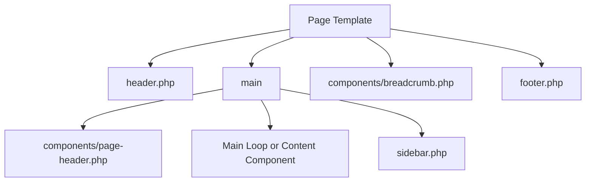

# WordPress クラシックテーマ仕様

Startify-Appで現在Git管理しているクラシックテーマについて、Template構成、共通部品、Theme Support、Asset、表示機能、Metadata、コメント、メール、管理画面調整、およびWordPress Coreとの統合方法を定義します。

WordPress領域全体の役割、公開構成、Git管理境界、Coreとの責務境界は`specifications/backend/wordpress/overview.md`を参照します。カスタム投稿タイプ、Taxonomy、Query、検索、REST API、Ajaxの詳細は`specifications/backend/wordpress/content-and-api.md`で定義します。

## 1. 適用範囲

本書の対象Themeは次のとおりです。

| 項目 | 現在値 |
| --- | --- |
| Theme名 | Startify Classic Theme |
| Theme URI | `https://github.com/DesignSupply/startify-app` |
| Author | DesignSupply.LLC |
| Directory | `backend/wordpress/wp-content/themes/startify-classic-theme/` |
| Version | `1.0.0` |
| Text Domain | `startify-classic-theme` |
| License | GNU General Public License v3.0 |
| 形式 | Classic Theme |

このThemeは、実案件で画面と機能を実装するための雛形です。現在のPlaceholder、Sample表示、Ajax Demoなどを完成済みのDesignや汎用Contentとして扱いません。

`LICENSE`にGPL v3のLicense全文を保持します。`screenshot.png`はWordPress管理画面のTheme Preview画像であると同時に、現在の`index.php`でSample画像として表示します。実案件のSite Logoや共通Fallback画像としては扱いません。

別Branchで整備中のBlock Themeは本書の対象外です。Block Theme統合後に、Theme間の共通処理とTheme固有処理を再監査します。

## 2. 読み込み構造

WordPressはTheme Rootの`functions.php`を読み込みます。現在の`functions.php`は、機能別Fileを次の順序で`require_once`します。

| File | 現在の責務 |
| --- | --- |
| `functions/actions.php` | Asset、Theme Support、管理画面、ShortcodeなどのAction |
| `functions/filters.php` | Title、Excerpt、Password保護、Helper、自動更新などのFilter |
| `functions/models.php` | 投稿タイプ・Taxonomy読込、Archive・検索Query |
| `functions/seo.php` | Metadata用Title、Description、Image、Type、URLの生成 |
| `functions/widgets.php` | Widget AreaとNavigation Menuの登録 |
| `functions/mail.php` | 承認待ち投稿の管理者メール通知 |
| `functions/api.php` | 独自REST API Routeの読込 |
| `functions/comment.php` | Comment・Trackback・Pingback表示Callback |
| `functions/ajax.php` | Theme内Ajax Sampleの読込 |

各FileはWordPressの公開APIとHookを通じて機能を登録します。Theme独自のDatabase接続、独自Bootstrap、独自Routing Layerは使用しません。

## 3. Template構成

### 3.1 Template Hierarchy

現在Git管理している主要Templateは次のとおりです。

| Template | 主な用途 |
| --- | --- |
| `index.php` | 最新の投稿を表示するHomeのSample表示と最終Fallback |
| `page.php` | 固定ページ |
| `singular.php` | `blog`を含む個別投稿 |
| `archive.php` | 投稿タイプArchiveと年月Archive |
| `taxonomy.php` | `blog_category`と`blog_tag`のArchive |
| `author.php` | Author Archive |
| `search.php` | 検索結果 |
| `404.php` | Not Found |
| `comments.php` | コメント領域 |
| `header.php` | Document開始、Metadata、Header、Navigation |
| `footer.php` | Footer、外部Service Script、`wp_footer()` |
| `sidebar.php` | 検索、Archive、Category、Tag、Widget Area |

`front-page.php`、`home.php`、`single-blog.php`など、より限定されたTemplateは現在存在しません。WordPress Template Hierarchyに従い、上表のTemplateへFallbackします。

### 3.2 共通Layout

主要画面は、概ね次の順序で構成します。

`header.php`は`wp_head()`、`footer.php`は`wp_footer()`を呼び出します。Theme・Plugin・WordPress Coreが登録するAssetやMarkupを出力するため、これらのHookを削除しません。

### 3.3 Template Part

`components/`の主な責務は次のとおりです。

| Component | 現在の責務 |
| --- | --- |
| `page-header.php` | ページ種別に応じた見出し情報 |
| `loop.php` | Archive・検索・Sample Queryの投稿概要 |
| `content-page.php` | 固定ページ本文 |
| `content-single.php` | 個別投稿のMetadata、本文、Author情報 |
| `pagenation.php` | Archive・検索のページネーション |
| `pager.php` | 個別投稿の前後記事Navigation |
| `breadcrumb.php` | 画面表示用Breadcrumb |
| `json-ld.php` | BreadcrumbのJSON-LD |
| `meta.php` | Metadata、OGP、Twitter、Canonical、PWA関連Tag |
| `share-buttons.php` | SNS Share Link |
| `search-form.php` | 検索Form |
| `select-date.php` | 年月Archive選択 |
| `select-category.php` | Blog Category選択 |
| `tag-cloud.php` | Blog Tag Cloud |
| `logo.php` | Custom LogoまたはSite名 |
| `login-button.php` | Login・Logout Link |
| `comment-form.php` | コメントForm設定 |
| `comment-list.php` | Comment、Trackback、Pingback一覧 |
| `widget-global-navi.php` | Global Navigation Menu |
| `widget-sitemap.php` | Sitemap Menu |
| `widget-sidebar.php` | Sidebar Widget Area |
| `copyright.php` | Copyright表示 |

Template間で再利用する表示は`get_template_part()`を基本とし、画面固有のMain Loopは対象Templateに置きます。

## 4. Theme SupportとWordPress出力調整

### 4.1 現在有効なTheme Support

現在のThemeは次を有効化しています。

- `title-tag`
- `automatic-feed-links`
- `custom-logo`
- `post-thumbnails`
- `menus`

登録処理は現在、一部だけが`after_setup_theme`で実行され、その他はFile読込時に実行されます。また、WordPressが参照する`$content_width`ではなく`$contentWidth`へ`1440`を設定しています。Theme Setupの集約、正しいContent Width、Asset登録の改善はIssue #56で管理します。

固定ページでは、`init`時にThumbnail Supportを削除します。カスタム投稿タイプ`blog`ではThumbnailをSupportします。

### 4.2 Head・Body・Core出力の調整

現在は主に次のWordPress標準出力を調整します。

- Generator情報を`wp_head`から削除する
- RSD LinkとWindows Live Writer Manifest Linkを削除する
- Emoji関連Script・Style・Mail Filterを削除する
- WordPress標準Favicon Requestを空Responseで終了する
- Global StylesをFrontendでDequeueする
- `wp_global_styles_render_svg_filters`を`wp_body_open`から削除する
- Recent Comments WidgetのInline Styleを削除する
- Admin BarをFrontendで非表示にする
- Excerptの`wpautop`を削除する

これらはクラシックテーマの現在実装です。Core更新やPlugin導入時は、削除を維持するかを再確認し、削除する場合はTheme・Pluginが対象の標準出力へ依存していないことを確認します。

`wp_body_open`と`wp_footer`には、現在Sample Commentを出力するCallbackがあります。実案件でMarkupを追加するためのHook位置として存在し、完成済みContentではありません。

## 5. Asset

### 5.1 Frontend Asset

現在は`wp_enqueue_scripts`から次を読み込みます。

| Handle | File | 種別 |
| --- | --- | --- |
| `style-css` | `style.css` | Theme Stylesheet |
| `main-css` | `assets/css/main.min.css` | Main CSS |
| `main-js` | `assets/js/main.min.js` | JavaScript Module |
| `ajax-loading-js` | `plugins/ajax-loading/post.js` | Ajax追加読込Sample |
| `ajax-post-js` | `plugins/ajax-post/post.js` | Ajax POST Sample |

Main CSSはCharacter Set宣言、Main JavaScriptはStrict Modeだけを持つ最小Entry Pointです。内容が少ないこと自体は現在の雛形方針であり、不具合として扱いません。

現在のRepositoryには、このTheme専用のSource Asset、Minify処理、Build Command、Source Map生成を定義していません。`.min.css`と`.min.js`というFile名ですが、追跡中のFileをThemeのEntry Pointとして直接管理します。将来Build環境を導入する場合は、Sourceと生成物のGit管理境界、Command、出力先を別途定義します。

現在のHandleにはTheme固有Prefixがなく、Asset Versionは`null`です。また、FrontendでWordPress標準の`jquery`Handleを登録解除します。Theme Setup、Handle、Cache Busting、jQueryとの共存はIssue #56で改善します。

### 5.2 Login画面Asset

`login_enqueue_scripts`から次を読み込みます。

- `functions/login/customize.css`
- `functions/login/customize.js`

現在はFrontend Assetと同様に、Theme固有PrefixのないHandleとVersion未設定で登録します。改善方針はIssue #56に含めます。

### 5.3 Asset URL

Theme Asset URLは`get_template_directory_uri()`から生成します。Theme Directory名やWordPressの公開PathをURL文字列として固定しません。

## 6. Navigation、Widget、Shortcode

### 6.1 Navigation Menu

現在は次のLocationを登録します。

| Location | 用途 |
| --- | --- |
| `global-navi` | HeaderのGlobal Navigation |
| `sitemap` | FooterのSitemap Navigation |

表示は`wp_nav_menu()`を使用します。Menuが未割当の場合のFallbackはWordPress標準動作に従います。

### 6.2 Widget Area

Sidebar用に`widget-sidebar`を登録し、`dynamic_sidebar()`で表示します。Widget Areaは管理画面から編集します。

### 6.3 Shortcode

現在は次のShortcodeを登録します。

| Shortcode | 戻り値 |
| --- | --- |
| `[home_url]` | Home URL |
| `[theme_url]` | Theme Directory URL |

Shortcodeは値を返し、直接Echoしません。利用Contextに応じた最終的なEscapeとURL組み立てを確認します。

## 7. 投稿・固定ページの表示

### 7.1 TitleとExcerpt

現在のThemeは、表示用TitleとExcerptへ次のFilterを適用します。

| 対象 | 現在値・挙動 |
| --- | --- |
| Document Title区切り文字 | `|` |
| Excerpt文字数 | 60 |
| Excerpt末尾 | `…` |
| Password保護投稿のExcerpt | `この投稿はパスワードで保護されています` |
| Password保護投稿のTitle Prefix | `【パスワード保護】%s` |
| 非公開投稿のTitle Prefix | `【非公開】%s` |

Excerptから`wpautop`を削除し、自動Paragraph整形を適用しません。表示値のContext別Escapeと、画面表示用Titleで許可するHTMLはIssue #48で整理します。

### 7.2 投稿概要

`components/loop.php`は、Archive、検索、Front PageのSub Query、Ajax Sampleで再利用します。現在は次を表示します。

- 一覧内のIndex番号
- 投稿Title
- Permalink
- ThumbnailまたはFallback Placeholder
- Excerpt

### 7.3 固定ページ

`page.php`はMain Loopを実行し、`components/content-page.php`でTitle、Permalink、本文、編集Linkを表示します。

### 7.4 個別投稿

`singular.php`はPassword保護状態を確認し、Password入力済みの場合に次を表示します。

- 投稿ID
- TitleとPermalink
- `blog_category`と`blog_tag`
- 公開日と更新日
- ThumbnailまたはFallback Placeholder
- 本文と分割ページLink
- Author名、Avatar、紹介文、Archive Link
- 編集Link
- SNS Share Link
- 前後記事Navigation
- コメント

更新日の判定と日時出力の改善はIssue #55で管理します。前後記事やQueryの詳細は`content-and-api.md`で定義します。

### 7.5 Password保護

個別投稿では`post_password_required()`を使用します。Password未入力または不一致の場合はWordPress標準のPassword Formを表示し、本文、Share Link、前後記事、コメントを表示しません。

Password Formの案内文、Label、Submit Text、Title PrefixはFilterで日本語へ変更します。REST APIでのPassword保護本文の扱いはIssue #44で管理します。

## 8. コメント

`singular.php`はPassword確認後に`comments_template()`を呼び出します。`comments.php`もPassword保護状態を確認してから、コメント一覧とFormを読み込みます。

現在のコメント機能は次を含みます。

- Comment、Reply、承認待ち表示
- Avatar、投稿者Link、投稿日時、編集Link
- コメントページネーション
- Trackback・Pingback一覧
- Comment FormのName、Email、本文

現在のComment Formは未定義の`$req`と`$commenter`を参照し、Trackback・Pingback CallbackにはMarkupの不整合があります。変数初期化とList構造はIssue #57、Context別EscapeはIssue #48で管理します。

## 9. Metadata、構造化データ、外部Service

### 9.1 Metadata

`header.php`は`components/meta.php`を読み込みます。現在は次を出力します。

- Character Set、Viewport、表示関連Metadata
- Robots
- Description
- Canonical URL
- Open Graph
- Twitter Card
- Site Verification用Metadata
- PWA・Icon関連Metadata

Title、Description、OGP Image、Page Type、Page URLは`functions/seo.php`のHelperで生成します。正規URL生成はIssue #49、Metadataと外部Service設定はIssue #51で改善します。

### 9.2 BreadcrumbとJSON-LD

主要Templateは画面末尾で`components/breadcrumb.php`を読み込み、`header.php`は`components/json-ld.php`を読み込みます。

現在は固定ページ階層、投稿タイプArchive、年月Archive、Taxonomy、個別投稿、Author、検索、404を条件分岐し、画面表示用BreadcrumbとJSON-LDを別々に生成します。両者の共通化と安全なJSON生成はIssue #50で管理します。

### 9.3 SNS Share

個別投稿は`components/share-buttons.php`でSNS Share Linkを表示します。URL生成、Query Parameter、対象Serviceの整理はIssue #53で管理します。

### 9.4 外部Service ID

Google Analytics、Site Verification、SNS関連ID、Icon、Default OGP Imageなどは現在Placeholderを含みます。現在実装に合わせた設定取得と、将来のOptions APIへの展開はIssue #51で管理します。

Block Themeとの共通設定を先に実装せず、現在のクラシックテーマ内で取得処理を整理します。

## 10. Loginと管理画面

### 10.1 Login・Logout

HeaderはLogin状態に応じてLogin LinkまたはLogout Linkを表示します。Logout後は`wp_safe_redirect()`でHome URLへRedirectします。

Login画面ではTheme固有のCSS・JavaScriptを読み込みます。認証処理自体はWordPress Coreを利用し、Theme独自の認証方式は実装しません。

### 10.2 管理画面表示

現在は標準投稿メニューを全Userで非表示にし、特定Role名を`current_user_can()`へ渡してTools Menuを非表示にしようとしています。Menu非表示は認可の代替ではなく、URLからの操作可否はWordPress Coreと対象機能のCapability判定に従います。

Role判定をCapability基準へ整理し、Roleごとの表示方針を明確にする改善はIssue #54で管理します。

### 10.3 User Profile

User Profileへ次のContact Methodを追加します。

- Facebook
- Twitter

保存とValidationはWordPress標準のUser Profile処理に従います。

## 11. メール通知

投稿Statusが`pending`へ遷移した際、Themeは管理者Email Addressへ承認待ち通知を送信します。現在のMessageはSite名、投稿Title、編集画面Linkを含みます。

現在はHeaderを`$addHeader`へ構築しながら、`wp_mail()`へ未定義の`$headers`を渡しています。また、対象投稿タイプと送信先Email Addressの検証が不十分です。通知条件、Header、送信先、Error処理はIssue #52で管理します。

本番のSMTP認証や配信ServiceはTheme仕様に含めません。ローカル配送はDocker環境のMailpitを使用します。

## 12. 出力と安全性

現在のThemeには、正しくEscapeされている出力と、Contextに応じた処理が不足する出力が混在します。現在確認済みの範囲と改善方針はIssue #48で管理します。

現在は`wp_kses_allowed_html`へFilterを追加し、許可Tagの`source`要素へ`srcset`Attributeを追加しています。この拡張はTheme内で`source`要素のResponsive Image候補を扱うための現在実装です。許可対象を追加する場合は、使用Contextと必要なAttributeを限定し、広すぎるAllow Listにしません。

改善時は次を基本とします。

- Plain Textは`esc_html()`を使用する
- HTML Attributeは`esc_attr()`を使用する
- URLは`esc_url()`を使用する
- 投稿ID、件数、Page番号は整数として扱う
- 投稿本文は`the_content()`を使用する
- ExcerptはWordPressの表示用Filterを維持する
- Comment本文は`comment_text()`を使用する
- WordPressが生成する表示用HTMLを無条件にText化しない
- JavaScriptへ値を渡す場合はJSONまたはWordPressのAsset APIを使用する
- URLやObjectを返すAPIのErrorと未取得状態を確認する

画面表示用の投稿Titleでは、` `だけを許可する方針です。Attribute、Metadata、JSON-LD、APIのPlain TextではすべてのHTML Tagを除去します。この方針はIssue #48の実装完了後に現在実装として再確認します。

AjaxのNonceと入力ValidationはIssue #42、検索QueryはIssue #43、REST APIの認証・入力・ResponseはIssue #44〜#47で扱います。

## 13. 更新方針

現在のThemeは、PluginとThemeの自動更新Filterを有効にしています。この方針は維持し、導入するPluginとThemeは配布元、保守状況、WordPressとの互換性を確認した信頼できるものに限定します。

Issue #56の対応後は、Theme Assetを変更するReleaseでTheme VersionとCache Bustingを一致させます。

WordPress Core更新後は、Template、Theme Support、Asset、管理画面、Metadata、コメント、メール、REST API、Ajaxを確認します。

## 14. 既知の課題

現在実装で確認済みの課題は次のIssueで管理します。Issue解決後は、改善後の実装に合わせて本書を更新し、解決済みの課題説明を削除または現在仕様へ置き換えます。

| Issue | 対象 |
| --- | --- |
| #48 | Context別Escape |
| #49 | Canonical、OGP、Twitterの正規URL |
| #50 | 画面BreadcrumbとJSON-LD |
| #51 | Metadataと外部Service設定 |
| #52 | 承認待ち投稿の管理者メール通知 |
| #53 | SNS Share Link |
| #54 | 管理画面MenuのCapability判定 |
| #55 | 更新日表示と日時比較 |
| #56 | Theme SetupとAsset登録 |
| #57 | Comment FormとComment一覧 |

Ajax、REST API、Queryの詳細な課題は`content-and-api.md`で管理し、本書にはTheme表示へ直接影響する境界だけを残します。

## 15. Theme適用時の申し送り事項

次は現在の既知障害ではなく、Themeを実案件へ適用または拡張するときの確認事項です。

### 15.1 Global関数名

現在は`register_script()`、`custom_logo()`、`post_modified()`、`seo_meta_url()`など、Theme固有PrefixのないGlobal関数が存在します。現在同名衝突は確認していませんが、変更時はPluginや共通処理との衝突を避けるため、Startify固有Prefixを採用します。一括Renameは現在の文書整備に含めません。

### 15.2 Fallback画像

Thumbnail未設定時の画像Pathには`********.jpg`というPlaceholderがあります。利用プロジェクトで実在するFallback画像へ置き換えるか、画像を出力しない方針を決定します。現在実装済みの共通画像Assetとして扱いません。

### 15.3 未使用Helper

`is_subpage_by_slug()`は現在Theme内から使用されていません。使用開始前に、対象Pageが存在しない場合のNull処理を追加します。不要であれば削除します。

### 15.4 国際化

`style.css`では、Theme Directory名と一致する`startify-classic-theme`をText Domainとして定義しています。

一方、現在はTheme同梱の翻訳File、`languages/`、明示的なText Domain読込処理を管理していません。一部の国際化関数ではText Domainを指定せず、多くのTheme固有文言は日本語を直接記述しています。

現在は日本語向けの雛形Themeとして扱います。多言語対応が必要になった時点で、Theme固有文言、Text Domainの指定、翻訳後のContext別Escape、Domain Path、翻訳Fileの生成・配置・Git管理方針をまとめて設計します。

## 16. 検証

クラシックテーマに関係する変更では、変更範囲に応じて次を確認します。

- Themeを有効化できる
- PHP構文Errorと実行時Warningが発生しない
- Front Page、固定ページ、個別投稿、Archive、Taxonomy、Author、検索、404が表示できる
- `wp_head()`、`wp_body_open()`、`wp_footer()`が実行される
- Theme Stylesheet、Main Asset、Login Assetが読み込まれる
- Navigation MenuとWidget Areaが表示できる
- Custom LogoとThumbnailが表示できる
- Password保護投稿で保護対象Contentを表示しない
- Comment Form、Comment一覧、Reply、Paginationが動作する
- Metadata、Canonical、OGP、Twitter、JSON-LDを出力できる
- Login、Logout、管理画面Menuが現在方針どおり動作する
- 承認待ち投稿のメールをローカルMailpitで確認できる
- 動的な値でHTML、URL、JSON、JavaScriptが壊れない
- Plugin・Theme・Core更新後に主要画面と管理画面が動作する

静的なPHP構文確認は、Theme配下のPHP Fileを対象に実行します。ブラウザー、管理画面、REST API、Ajax、メールなど実行環境が必要な検証は、Docker起動後に行います。

## 17. 移行・監査元

本書は次を照合して作成しました。

- `backend/wordpress/wp-content/themes/startify-classic-theme/`
- `specifications/backend/wordpress/overview.md`
- `specifications/server/docker/overview.md`
- `specifications/server/docker/setup-and-operations.md`
- Issue #42〜#57

WordPress Coreの一般的なTheme仕様は本書へ複製せず、使用中のWordPress CoreとWordPress公式資料を正本とします。
