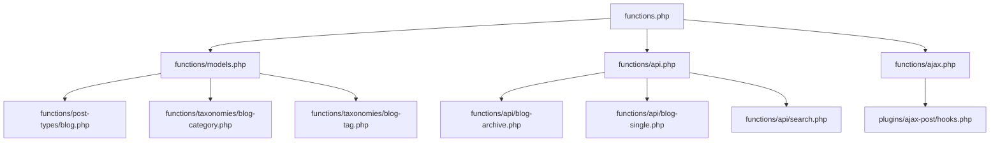

# WordPress コンテンツ・API仕様

Startify-Appのクラシックテーマが登録するコンテンツモデル、画面Query、検索、独自REST API、およびAjax Sampleの現在仕様を定義します。

WordPress領域全体の役割、公開構成、Git管理境界は`specifications/backend/wordpress/overview.md`、Template、表示、Assetなどの詳細は`specifications/backend/wordpress/classic-theme.md`を参照します。WordPress Coreが提供する投稿、Taxonomy、Query、REST API、Ajaxの一般仕様は、使用中のWordPress CoreとWordPress公式資料を正本とします。

## 1. 適用範囲

本書は、現在Git管理されている`backend/wordpress/wp-content/themes/startify-classic-theme/`の次の機能を対象とします。

- カスタム投稿タイプ`blog`
- `blog_category`と`blog_tag`
- Archive、Taxonomy、Author、年月、検索のQuery
- テーマ独自の公開GET REST API
- ブログ追加読込とAjax POSTのSample
- 画面とAPIにおけるPassword保護の境界

投稿の作成・更新・削除を行う独自API、WordPress User認証API、Block Theme固有実装、外部CDN・Cache、本番Infrastructureは現在の対象外です。

## 2. 読み込み構造

`functions.php`から、コンテンツとAPIに関係するFileを次の順序で読み込みます。

Ajax追加読込のPHP FileはThemeの読み込み経路へ登録されず、現在はBrowserから直接呼び出されます。この構成の改善はIssue #42で管理します。

## 3. コンテンツモデル

### 3.1 固定ページ

固定ページはWordPress標準の`page`を使用します。Themeは独自の固定ページ投稿タイプを登録しません。画面検索では`page`を検索対象に含める意図があります。

### 3.2 ブログ

Themeは次のカスタム投稿タイプを`init`時に登録します。

| 項目 | 現在値 |
| --- | --- |
| 投稿タイプ | `blog` |
| 表示名 | ブログ |
| 公開 | 有効 |
| Archive | 有効 |
| 公開Slug | `blog` |
| Query Var | 有効 |
| REST API | 有効 |
| 階層 | 無効 |
| Capability Type | `post` |
| Meta Capability Mapping | 有効 |
| User削除時の投稿削除 | 無効 |

Supportする機能は次のとおりです。

- Title
- Editor
- Author
- Thumbnail
- Excerpt
- Comment
- Revision

`show_in_rest`を有効にしているため、WordPress標準REST APIでも`blog`を利用できます。Theme独自REST APIは標準REST APIを置き換えるものではありません。

### 3.3 ブログCategory

| 項目 | 現在値 |
| --- | --- |
| Taxonomy | `blog_category` |
| 対象投稿タイプ | `blog` |
| 公開Slug | `blog-category` |
| 階層 | 有効 |
| REST Base | `blog_category` |
| 管理一覧Column | 無効 |
| Quick Edit | 無効 |

### 3.4 ブログTag

| 項目 | 現在値 |
| --- | --- |
| Taxonomy | `blog_tag` |
| 対象投稿タイプ | `blog` |
| 公開Slug | `blog-tag` |
| 階層 | 無効 |
| REST Base | `blog_tag` |
| 管理一覧Column | 無効 |
| Quick Edit | 無効 |

## 4. 公開画面とQuery

### 4.1 一覧画面

| 画面 | Template | 現在のQuery |
| --- | --- | --- |
| ブログArchive | `archive.php` | 原則としてMain Query |
| Category・Tag Archive | `taxonomy.php` | Main Query |
| Author Archive | `author.php` | Main Queryを`blog`へ変更 |
| 年月Archive | `archive.php` | Main Query |
| 検索結果 | `search.php` | Main Queryへ独自検索Filterを適用 |
| `index.php`のSample・Fallback表示 | `index.php` | `blog`を5件取得するSub Query |

Author Archiveでは`pre_get_posts`を利用し、FrontendのMain Queryだけを`blog`へ変更します。

`archive.php`は、任意のGET Parameterがある場合にTemplate内で別の`WP_Query`を作成します。`category`または`tags`をQuery Varとして受け取り、`blog_category`または`blog_tag`で絞り込みます。一方、Category選択UIは標準Taxonomy Archiveへ遷移します。この二重経路とPaginationの不整合はIssue #43で管理します。

### 4.2 Paginationと前後記事

Archive、Taxonomy、Author、検索結果は`components/pagenation.php`を使用し、Globalな`$wp_query`から総Page数と現在Pageを取得します。

個別投稿は`components/pager.php`でWordPress標準の前後記事Linkを表示します。CategoryやTagが同じ投稿だけには限定しません。

Template内のSub QueryとGlobal Queryの不一致、一覧番号、Pagination Link、年月判定の改善はIssue #43で管理します。

## 5. キーワード検索

Frontend検索は、WordPress標準の検索Formから`s`をGETで送信します。現在の独自`posts_search` Filterは、次を検索対象とする意図で実装されています。

- 固定ページ`page`
- ブログ`blog`
- 投稿Title
- 投稿本文
- 投稿Metadataの値

ただし、現在の投稿タイプSQLは複数投稿タイプを正しく指定できていません。また、Filterの適用範囲、LIKE値のEscape、SQL組み立て、Metadataの範囲、重複排除にも既知の課題があります。

検索対象へ公開Custom Fieldを含める方針は維持します。改善時は、保護されたMeta Keyと内部管理値を除外し、Title、本文、Excerpt、公開Custom Fieldを安全に検索します。詳細はIssue #43で管理します。

## 6. Password保護

画面の個別投稿は`post_password_required()`を確認し、Password未確認時には本文、Share Button、前後記事、Commentを表示せず、WordPress標準のPassword Formを表示します。

一覧用ComponentはWordPressのExcerpt Filterによって、Password保護投稿の抜粋を案内文へ置き換えます。

一方、現在のTheme独自REST APIは`post_excerpt`と`post_content`を直接Responseへ含め、Password保護状態を確認しません。公開済みのPassword保護投稿も本文と抜粋を取得できるため、Issue #44で改善を管理します。

## 7. Theme独自REST API

### 7.1 役割と公開範囲

Themeは公開済み`blog`を読み取る独自GET Endpointを登録します。書き込みEndpointと独自認証処理はありません。

すべてのRouteは、現在`permission_callback`で常に`true`を返す公開APIです。公開済みコンテンツだけを返すことが前提ですが、Password保護本文の扱いにはIssue #44の既知課題があります。

### 7.2 現在のEndpoint

| Method | Endpoint | 現在の処理 |
| --- | --- | --- |
| GET | `/wp-json/wp/api/blog` | 公開済み`blog`を全件取得 |
| GET | `/wp-json/wp/api/blog/{id}` | 指定IDの公開済み`blog`と前後記事を取得 |
| GET | `/wp-json/wp/api/search/{keywords}` | 公開済み`blog`をキーワード検索して全件取得 |

現在のNamespaceは`wp/api`です。WordPress Coreとの識別とVersioningが明確な`cms/v1`への変更はIssue #47で管理します。

### 7.3 現在の投稿Response

各Endpointは投稿ごとに次のFieldを返します。

| Field | 現在値 |
| --- | --- |
| `ID` | WordPress投稿ID |
| `thumbnail` | Full SizeのThumbnail URL、未設定時は`false` |
| `slug` | 投稿Slug |
| `date` | Database上の投稿日時文字列 |
| `modified` | Database上の更新日時文字列 |
| `title` | Rawな`post_title` |
| `excerpt` | Rawな`post_excerpt` |
| `content` | Rawな`post_content` |

現在は一覧・検索・詳細ごとに同じ配列生成を重複しており、WordPress表示Filterを適用しません。Field名、型、日時、画像、Author、Taxonomy、保護状態、Rendered HTMLを共通化する改善はIssue #47で管理します。

### 7.4 ブログ一覧

ブログ一覧APIは`get_posts()`で公開済み`blog`を`posts_per_page => -1`として全件取得します。Page、取得件数、総件数、総Page数、前後Page Linkは提供しません。

全件取得の廃止、`page`と`per_page`の入力Validation、安定した並び順、Pagination HeaderはIssue #46で管理します。

### 7.5 ブログ詳細

ブログ詳細APIは、最初に公開済み`blog`を全件取得し、指定IDの配列Indexから隣接記事を求めます。Responseは次の位置順の配列です。

1. 新しい側の隣接記事
2. 現在の記事
3. 古い側の隣接記事

指定投稿や隣接記事が存在しない場合も配列要素へ直接Accessするため、Warningや不正なResponseになる可能性があります。ID Validation、404、境界処理、安定した前後関係、名前付きResponseへの変更はIssue #45で管理します。

### 7.6 ブログ検索

検索APIは`keywords`をPath Parameterで受け取り、Application側で`urldecode()`した値を`WP_Query`の`s`へ渡します。検索対象は`blog`で、結果を全件取得します。

検索Queryには`functions/models.php`のGlobalな`posts_search` Filterが影響します。Query Parameterへの変更、空文字・型・長さのValidation、Pagination、適用範囲の限定はIssue #43とIssue #46で管理します。

## 8. Ajax Sample

### 8.1 ブログ追加読込

`index.php`は公開状態を明示しない`blog`のSub Queryで最初の3件を表示し、追加読込Buttonを配置します。

`plugins/ajax-loading/post.js`は、Theme Directory名を含むURLをBrowser側で組み立て、`plugins/ajax-loading/loading.php`へ直接POSTします。PHP Fileは相対Pathから`wp-load.php`を読み込み、Offsetと追加件数を受け取り、投稿HTMLを含むJSONを返します。

現在はWordPress標準Ajaxの受付口を使わず、Nonce、Server側の取得上限、入力Validation、公開状態の明示が不足しています。現在の公開Pathとも送信先URLが一致しません。

### 8.2 Ajax POST Demo

`index.php`は`blog`を3件取得し、投稿IDを持つDemo Buttonを表示します。

`plugins/ajax-post/post.js`は、Localized Dataから`admin-ajax.php`とNonceを受け取り、次のActionへ投稿IDをPOSTします。

- `wp_ajax_ajax_post_action`
- `wp_ajax_nopriv_ajax_post_action`

現在のCallbackはデータを更新せず、受け取った`post_id`をJSONで返すSampleです。`check_ajax_referer()`の引数にタイプミスがあり、投稿IDの型、存在、投稿タイプ、公開状態を検証しません。JavaScript側もResponse BodyとApplication Errorを確認しません。

### 8.3 改善境界

両SampleをREST APIへ移行せず、WordPress標準の`admin-ajax.php`へ統合する改善はIssue #42で管理します。次を同Issueの範囲とします。

- Nonce検証
- 入力値の検証と取得件数上限
- 公開済み`blog`への限定
- WordPress標準JSON Response
- 通信失敗とApplication Errorの処理
- DOM生成後のScript実行
- Demoを表示する画面だけへのScript読込

## 9. 現在の責務境界

現在、投稿タイプ・Taxonomy・Query・REST Route・Ajax Actionはクラシックテーマ内にあります。これは現在実装として扱います。

Block Theme統合後にTheme間で共通化する場合は、Themeに依存しない登録処理や公開APIをmu-pluginなどへ移すことを別途設計します。現在の文書整備では、未実装のmu-plugin構想を現在仕様として適用しません。

## 10. 既知の課題

現在実装で確認済みの課題は次のIssueで管理します。Issue解決後は、改善後の実装に合わせて本書を更新し、解決済みの課題説明を現在仕様へ置き換えます。

| Issue | 対象 |
| --- | --- |
| #42 | Ajax SampleのWordPress標準Ajaxへの統合、Nonce、入力、Response、Script読込 |
| #43 | 画面検索、Archive Query、Pagination、年月判定 |
| #44 | 独自REST APIでのPassword保護投稿 |
| #45 | ブログ詳細REST APIのID、404、前後記事、Response構造 |
| #46 | ブログ一覧・検索REST APIのPaginationと入力Validation |
| #47 | 独自REST APIのNamespace、Versioning、共通Response Schema |

Issue #43〜#47は、検索条件、Password保護、詳細取得、Pagination、共通Schemaで相互に関係します。実装時はIssue間の依存関係を確認し、同じ処理を異なる仕様で重複実装しません。

## 11. 変更時の方針

- 投稿タイプやTaxonomyの内部名、公開Slug、REST Baseを変更する場合は、既存URL、Rewrite Rule、Template、API Clientへの影響を確認する
- 公開Queryは投稿タイプと投稿Statusを明示する
- Main Queryを変更する場合はFrontendと対象画面に限定する
- Search Filterを追加する場合は管理画面、REST API、Sub Queryへの影響を限定する
- Query入力はWordPress APIを通じて検証・正規化する
- APIの互換性を壊す変更ではNamespace VersionとClient移行を確認する
- 公開APIからRawな非公開値、投稿Password、編集用情報を返さない
- AjaxのNonceを認可の代替として扱わない
- 書き込み処理を追加する場合は、NonceだけでなくCapabilityと対象Resourceを検証する
- 実装変更と同じ作業範囲で本書を更新する

## 12. 検証

### 12.1 現在実装の確認

コンテンツとAPIに関係する変更では、変更範囲に応じて現在実装と既知の課題を確認します。

- `blog`、`blog_category`、`blog_tag`が想定した設定で登録される
- ブログArchive、Category、Tag、Author、年月、検索の一覧が表示される
- Template内のSub QueryとPaginationが参照するGlobal Queryの差異を確認する
- Title、本文、投稿Metadataの検索挙動と適用対象Queryを確認する
- 未保護投稿とPassword保護投稿の画面表示を確認する
- Theme独自REST APIのEndpoint、取得対象、Field、全件取得、Password保護本文の現在挙動を確認する
- Ajax追加読込の直接呼出しとAjax POST Demoの現在挙動を確認する
- Issue #42〜#47に記録済みのWarning、Error、入力不正時の挙動を再現できる範囲で確認する

既知の課題を確認できた場合は、現在仕様として正常であるとみなさず、対応するIssueの範囲と一致することを確認します。

### 12.2 関連Issue対応後の回帰確認

Issue #42〜#47の実装変更後は、対応した範囲に応じて次を確認します。

- 一覧結果、記事番号、Paginationが同じQueryを参照する
- Title、本文、Excerpt、公開Custom Fieldの検索結果が改善後の仕様と一致する
- 管理画面と無関係なQueryへ検索Filterが影響しない
- 未保護投稿とPassword保護投稿の画面・API Responseが改善後の仕様と一致する
- REST APIの正常、入力不正、0件、Not Found、境界Pageを確認する
- REST APIのField名、型、HTTP Status、Headerが改善後の仕様と一致する
- Ajaxをログイン・非ログイン双方で確認する
- AjaxのNonce不正、入力不正、対象なし、通信失敗を確認する
- PHP Warning、Notice、JavaScript Errorが発生しない
- 実装結果に合わせて本書の現在仕様と既知の課題を更新する

PHPの静的構文確認に加え、画面、REST API、Ajaxの実行確認はDocker起動後のWordPress環境で行います。

## 13. 移行・監査元

本書は次を照合して作成しました。

- `backend/wordpress/wp-content/themes/startify-classic-theme/`
- `specifications/backend/wordpress/overview.md`
- `specifications/backend/wordpress/classic-theme.md`
- Issue #42〜#47

WordPress Coreの一般的な投稿、Taxonomy、Query、REST API、Ajax仕様は本書へ複製せず、使用中のWordPress CoreとWordPress公式資料を正本とします。
