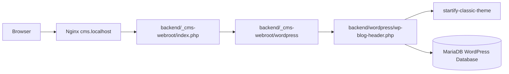

# WordPress 概要仕様

Startify-AppにおけるWordPressの役割、公開構成、Git管理境界、独自Theme・Pluginの位置付け、およびWordPress Coreとの統合方針を定義します。

本書はWordPress領域全体の概要仕様です。WordPress Coreの内部仕様を再定義する文書ではありません。クラシックテーマのTemplate、Theme Support、Asset、Metadata、画面表示などの詳細は`specifications/backend/wordpress/classic-theme.md`、投稿・Taxonomy・検索・REST API・Ajaxの詳細は`specifications/backend/wordpress/content-and-api.md`で定義します。これらの後続仕様書は現在作成予定です。

Docker Container、Nginx、MariaDB、Mailpit、初回Setup Commandの詳細は、`specifications/server/docker/overview.md`と`specifications/server/docker/setup-and-operations.md`を参照します。

## 1. 目的と適用範囲

`backend/wordpress/`は、WordPressを利用したWebサイトとCMSの実装基盤です。

Startify-Appでは、WordPress Coreの機能を独自に複製せず、標準API、Hook、Template Hierarchy、Theme API、REST APIなどを利用してThemeを実装します。本Repositoryで管理する中心的な対象は、WordPress Coreそのものではなく、Startify-App固有のTheme、コンテンツモデル、公開構成、およびCoreとの統合方法です。

現在の主な役割は次のとおりです。

- WordPress管理画面によるコンテンツとユーザーの管理
- 固定ページの管理
- カスタム投稿タイプ`blog`によるブログ記事の管理
- `blog_category`と`blog_tag`によるブログ分類
- クラシックテーマによるWebサイト画面の表示
- WordPress標準REST APIとテーマ独自REST APIによるデータ提供
- コメント、Widget、Navigation Menu、メール通知などのWordPress機能

本書は現在のSingle Site構成を対象とします。WordPress Multisite、本番Infrastructure、外部Object Storage、CDN、Backup、監視、Deployment、Block Theme固有実装は対象外です。

## 2. 正本と責務境界

### 2.1 WordPress Core

WordPress Coreの動作、標準Database Schema、標準Role・Capability、標準APIの詳細は、使用中のWordPress CoreとWordPress公式資料を正本とします。本書へCoreのVersion、標準Tableの全定義、全Column、一般的なAPI仕様を複製しません。

WordPress Coreは`make wp-download`または`make wp-update`で取得・更新され、Git管理対象外です。現在のCommandは取得Versionを固定していないため、RepositoryのCommitだけでは各開発環境のCore Versionを保証しません。

Core更新時は、使用するAPIの互換性とStartify-AppのTheme動作を検証します。Coreの変更によりThemeの動作やプロジェクト固有の前提が変わった場合は、実装と関連仕様書を併せて更新します。

### 2.2 独自Theme

現在Git管理している独自Themeは次のクラシックテーマです。

| 項目 | 現在値 |
| --- | --- |
| Theme名 | Startify Classic Theme |
| Directory | `backend/wordpress/wp-content/themes/startify-classic-theme/` |
| Version | `1.0.0` |
| Text Domain | `startify-classic-theme` |
| 形式 | Classic Theme |

現在仕様は、Git管理されている`startify-classic-theme`と現在のWordPress実装を正本とします。

Block Themeは別Branchで整備中です。本Branchの現在仕様へ未統合のため、現在実装として扱いません。Block Themeの統合後に、クラシックテーマとの差異、共通化対象、Theme固有処理、mu-pluginの責務を再監査します。

### 2.3 Pluginとmu-plugin

現在のBranchでは、独自Pluginとmu-pluginをGit管理していません。

`backend/wordpress/.gitignore`は第三者PluginをGit管理対象外とし、独自Plugin用の例外Pathとして`backend/wordpress/wp-content/plugins/custom-plugin/`を定義していますが、現在その実装は存在しません。

Theme固有Directory内にあるAjax Sampleは、WordPressのPlugin管理画面で有効化するPluginではなく、クラシックテーマから読み込むSample実装です。

将来のmu-plugin化やOptions APIによる共通設定管理は構想段階であり、現在仕様には含めません。

## 3. DirectoryとGit管理境界

WordPress領域の主要DirectoryとFileは次のとおりです。

| Path | 役割 | Git管理 |
| --- | --- | --- |
| `backend/wordpress/` | WordPress Core、`wp-content`、独自Themeの配置先 | Coreは対象外、独自Themeは対象 |
| `backend/wordpress/wp-config.php` | 現在環境のWordPress設定と認証用Key・Salt | 対象外 |
| `backend/wordpress/wp-content/themes/startify-classic-theme/` | Startify独自クラシックテーマ | 対象 |
| `backend/wordpress/wp-content/plugins/` | WordPress Plugin | 第三者Pluginは対象外 |
| `backend/wordpress/wp-content/uploads/` | Media Upload | 対象外 |
| `backend/wordpress/wp-content/languages/` | 翻訳File | 対象外 |
| `backend/wordpress/wp-content/cache/` | Cache生成物 | 対象外 |
| `backend/wordpress/wp-content/upgrade/` | Update時の一時生成物 | 対象外 |
| `backend/_cms-webroot/` | Nginxが公開するDocument Root | Entry Pointなどを対象 |
| `backend/_cms-webroot/index.php` | WordPressを起動する公開Entry Point | 対象 |
| `backend/_cms-webroot/wordpress` | Document Root外のCoreを参照するSymbolic Link | 対象外 |

WordPress Core、`wp-config.php`、Upload、Cache、Log、Backup、Upgrade生成物、第三者Theme・PluginをCommitしません。独自実装を追加する場合は、`backend/wordpress/.gitignore`の例外Pathと実際のDirectoryを一致させます。

## 4. 公開構成

### 4.1 URLとDocument Root

ローカル環境のWordPress URLは次のとおりです。

| 項目 | URL・Path |
| --- | --- |
| Home URL | `https://cms.localhost` |
| Site URL | `https://cms.localhost/wordpress` |
| 管理画面 | `https://cms.localhost/wordpress/wp-admin/` |
| Nginx Document Root | `backend/_cms-webroot/` |
| WordPress Core | `backend/wordpress/` |

Home URLはWebサイトの公開URL、Site URLはWordPress Coreを配置するURLです。現在は両者を分離しています。

### 4.2 Entry PointとSymbolic Link

`backend/_cms-webroot/index.php`はThemeを有効にして、次のFileを読み込みます。

```text
backend/_cms-webroot/wordpress/wp-blog-header.php
```

現在のSymbolic Linkは次のDirectory単位の構成です。

```text
backend/_cms-webroot/wordpress
  → ../wordpress
```

Application CodeとCore本体はDocument Root外の`backend/wordpress/`に置き、公開Entry PointとCoreへのLinkだけを`backend/_cms-webroot/`から参照します。

現在の`make wp-symlinks`はこのDirectory単位のLinkを再現せず、WordPress直下の各項目を個別にLinkする処理です。Issue #39が解決するまでは、既存の正しいLinkへ`make wp-symlinks`を再実行しません。

### 4.3 Requestの流れ



Nginx、PHP-FPM、MariaDB、Mailpit、HTTPS証明書、Setupと更新Commandの詳細は、Docker関連仕様書を正本とします。

## 5. Startify-App固有のコンテンツモデル

現在のクラシックテーマは、WordPress標準の投稿・Taxonomy機構を利用して次のコンテンツモデルを登録します。

| 種別 | 内部名 | 公開Slug | 主な特徴 |
| --- | --- | --- | --- |
| 固定ページ | `page` | 固定ページごとのSlug | WordPress標準、階層あり |
| カスタム投稿 | `blog` | `blog` | 公開、Archiveあり、REST API有効 |
| Category型Taxonomy | `blog_category` | `blog-category` | `blog`に紐付き、階層あり |
| Tag型Taxonomy | `blog_tag` | `blog-tag` | `blog`に紐付き、階層なし |

`blog`はTitle、Editor、Author、Thumbnail、Excerpt、Comment、RevisionをSupportします。Capabilityは現在WordPress標準投稿と同じ`post`系Capabilityを使用します。

WordPress標準投稿タイプ`post`は登録されたままですが、クラシックテーマは管理画面メニューから非表示にしています。メニュー非表示は投稿タイプの無効化やCapabilityの剥奪ではありません。現在のRole判定とTools Menu制御の改善はIssue #54で管理します。

投稿・Taxonomy・検索・Archive・REST API・Ajax・Password保護の詳細と関連する既知の課題は、`specifications/backend/wordpress/content-and-api.md`で定義します。

## 6. Database利用方針

WordPressはLaravelと同じMariaDB Serviceを使用しますが、Databaseは分離します。接続設定、環境変数、Database作成手順はDocker関連仕様書を正本とします。

現在のクラシックテーマは独自Database Tableを作成していません。Startify-App固有のデータはWordPress標準機構へ保存します。

| Startify-Appのデータ | WordPressでの保存先 |
| --- | --- |
| `blog` | 標準投稿Table上のカスタム投稿タイプ |
| `blog`の追加情報 | 標準Post Metadata |
| `blog_category`・`blog_tag` | 標準Term・Taxonomy・Relationship |
| ThemeやSiteの設定 | 必要に応じてWordPress Option |
| User・Role | WordPress標準User・Role機構 |

ThemeやPluginから独自にDatabase接続を作らず、WordPress標準APIを優先します。`$wpdb`が必要な場合も、Table PrefixやTable名を文字列として固定せず、WordPressが提供する情報を使用します。

将来、標準機構で適切に表現できないデータに独自Tableが必要となった場合は、標準機構で代替できないことを確認し、Schema、作成・更新手順、削除方針、Backupへの影響を別途設計します。

WordPress標準Database Schemaの詳細は、使用中のWordPress CoreとWordPress公式資料を正本とします。Core更新時は、Startify-Appが利用する保存先やAPIへの影響を確認します。

## 7. ThemeとApplication Logicの現在境界

現在は、表示だけでなく次のApplication Logicもクラシックテーマ内にあります。

- カスタム投稿タイプとTaxonomyの登録
- Queryと検索Filter
- REST API RouteとResponse生成
- Ajax ActionとResponse生成
- Comment表示Callback
- WidgetとNavigation Menuの登録
- 承認待ち投稿のメール通知
- MetadataとBreadcrumbの生成
- 管理画面の表示調整
- Plugin・Themeの自動更新Filter

これらは現在実装として記録します。Theme内に存在することだけを理由に、現在仕様から除外しません。

Block Theme統合後にTheme間で共通化する場合は、Themeに依存しないApplication Logicをmu-pluginなどへ移動することを別途設計します。将来構想を先に現在仕様として適用せず、実装完了後に本書と関連仕様書を更新します。

## 8. Coreとの統合原則

ThemeをWordPress Coreの変更へ適合させやすくするため、次を基本方針とします。

- WordPressの公開API、Hook、Template Hierarchyを使用する
- Core内部の非公開実装や非推奨APIへの依存を避ける
- Databaseへ直接接続せず、WordPress APIを優先する
- CapabilityとNonceを、画面非表示や導線制御とは別に検証する
- 出力先のContextに応じてEscapeする
- Theme・Pluginとの共存を考慮し、GlobalなHookやAssetへ不要な変更を加えない
- Core更新後にTheme、管理画面、REST API、Ajax、メールを検証する

これらの適用方法と現在実装の既知課題は、`classic-theme.md`と`content-and-api.md`へ機能単位で記録します。

## 9. 更新方針

WordPress Coreの取得と更新は、Docker関連仕様書で定義するWP-CLI Commandを使用します。

クラシックテーマは現在、PluginとThemeの自動更新Filterを有効にしています。これは現在の運用方針として維持し、導入するPluginとThemeは、配布元、保守状況、WordPressとの互換性を確認した信頼できるものに限定します。

WordPress Coreの自動更新方針は、Plugin・Themeの自動更新Filterとは別に扱います。

## 10. 現在仕様と将来構想

### 10.1 現在仕様

- Git管理されている`startify-classic-theme`を現在の独自Themeとする
- WordPress Core、第三者Package、Upload、環境固有設定をGit管理しない
- Home URLとSite URLを分離する
- Document Root外のWordPress CoreをDirectory単位のSymbolic Linkで公開する
- WordPress標準の投稿、Taxonomy、User、Optionなどの機構を利用する
- 現在は独自Database Tableを使用せず、WordPress標準機構を利用する
- Theme内に存在するApplication Logicを現在実装として扱う
- PluginとThemeの自動更新を有効にする

### 10.2 将来構想

- 別Branchで整備中のBlock Themeを統合する
- Classic ThemeとBlock Themeの共通処理を再監査する
- Themeに依存しない共通設定とApplication Logicのmu-plugin化を検討する
- Options APIによる共通設定管理を検討する

将来構想は現在仕様として実装済みとは扱いません。統合や移行の完了後に、実装、Test、設定と照合して本書を更新します。

## 11. 検証

WordPress概要に関係する変更では、変更範囲に応じて次を確認します。

- `backend/_cms-webroot/wordpress`が`../wordpress`を参照する
- `backend/_cms-webroot/index.php`がWordPressを起動する
- Home URLとSite URLが現在設定と一致する
- Git管理しているクラシックテーマを有効化できる
- WordPress管理画面へAccessできる
- `blog`、`blog_category`、`blog_tag`が登録される
- WordPress Core、`wp-config.php`、Upload、第三者PackageがGit差分へ追加されない
- Themeが利用するWordPress APIに非推奨化や互換性問題がない
- Core更新後にTheme、管理画面、REST API、Ajax、メールが動作する

Dockerを使用する具体的な確認手順は`specifications/server/docker/setup-and-operations.md`に従います。

## 12. 関連仕様書とIssue

| 対象 | 参照先・状態 |
| --- | --- |
| Docker構成 | `specifications/server/docker/overview.md` |
| Setupと運用 | `specifications/server/docker/setup-and-operations.md` |
| クラシックテーマ | `specifications/backend/wordpress/classic-theme.md`、作成予定 |
| コンテンツとAPI | `specifications/backend/wordpress/content-and-api.md`、作成予定 |
| 公開Symbolic Link | Issue #39 |
| Theme、表示、Metadata、メール、管理画面 | Issue #42〜#44、#47〜#56 |
| 投稿、検索、REST API、Ajax | Issue #42〜#47 |

詳細な既知課題は、対象機能を定義する仕様書へ記録します。本書へすべてのIssue詳細を重複させません。現在のIssue範囲は後続仕様書が未作成の間だけ本書で案内し、`classic-theme.md`と`content-and-api.md`の作成後に各文書へ移します。

## 13. 移行元資料

本書は、次の旧資料と現在実装を照合して作成しました。

- `.cursor/rules/cms-overview.mdc`
- `backend/wordpress/wp-content/themes/startify-classic-theme/`
- `backend/wordpress/.gitignore`
- `backend/_cms-webroot/`
- `server/Makefile`
- `server/docker/nginx/nginx.conf`
- `specifications/server/docker/overview.md`
- `specifications/server/docker/setup-and-operations.md`

旧資料の標準Table一覧とERはWordPress Coreの一般仕様と重複するため、本書へ移行しません。Startify-App固有のDatabase利用方針だけを本書へ残し、標準Schemaの詳細は使用中のWordPress CoreとWordPress公式資料を参照します。

`.cursor/rules/cms-overview.mdc`は、WordPress関連仕様の完全移行監査が完了するまで移行元資料として残します。
