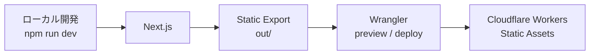
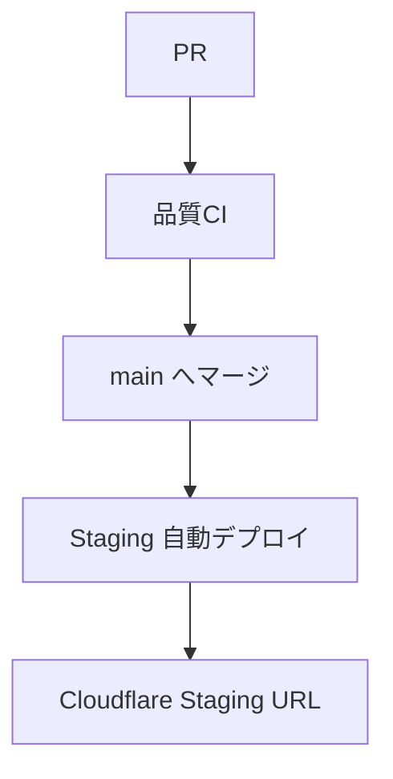

# Next.js Static Export — Cloudflare Workers Static Assets デプロイ仕様

Startify-AppにおけるNext.jsのCloudflare配信構成・設定・運用手順をまとめた仕様書です。実装済みのStaging環境を正本とし、ボイラープレートとして再利用できる形で記載しています。

---

## 1. 概要

- Next.jsの **Static Export** 成果物 `out/` をCloudflare上で配信する
- 配信基盤は **Cloudflare Workers Static Assets** を使用する
- Workerの実行コードや `main` スクリプトは現在使用しない（静的アセット配信のみ）
- **OpenNext／SSR** は現在の対象外
- Workers API、D1、R2、KV／Queuesも現在の対象外
- Next.jsは **ホスト OS の Node.js** で動かし、Docker化しない
- `server/` のLAMP環境（Laravel／WordPress）とは **独立した実行プロファイル** である

---

## 2. アーキテクチャ

### ローカル開発〜Cloudflare 配信



### GitHub Actions 経由（Staging）



手動再デプロイが必要な場合は、GitHub Actions画面から `workflow_dispatch` でStagingデプロイWorkflowを実行できる。

---

## 3. ディレクトリと設定ファイル

| パス | 役割 |
|---|---|
| `frontend/.nvmrc` | Node.js バージョン固定（`22.12.0`） |
| `frontend/next/package.json` | npm スクリプト、`engines.node`、`packageManager`、依存関係 |
| `frontend/next/package-lock.json` | 依存バージョンの正本 |
| `frontend/next/next.config.mjs` | Static Export（`output: 'export'`）、PWA、末尾スラッシュ等 |
| `frontend/next/wrangler.jsonc` | Cloudflare Worker 名、Static Assets 設定、Staging 環境 |
| `frontend/next/.env.example` | 環境変数テンプレート（Git 管理対象） |
| `frontend/next/.env.staging` | Staging 用環境変数（**Git 管理対象外**） |
| `.github/workflows/next-cloudflare-ci.yml` | PR／main push 時の品質 CI |
| `.github/workflows/next-cloudflare-staging.yml` | Staging 手動／自動デプロイ |

`.env.staging` は `.gitignore` によりGit管理対象外です。ローカルStagingビルド用に各自が作成します。GitHub Actionsでは空ファイルを一時作成し、実値はEnvironment Variablesから渡します。

---

## 4. Node.jsと依存関係

| 項目 | 値 |
|---|---|
| Node.js 固定場所 | `frontend/.nvmrc` |
| Node.js バージョン | `22.12.0` |
| `engines.node` | `>=22.12.0 <23` |
| npm バージョン | `10.8.2`（`packageManager: npm@10.8.2`） |
| Wrangler | `^4.115.0`（devDependencies、`package-lock.json` で固定） |

- 依存バージョンの正本は **`package-lock.json`**
- 初回セットアップ・依存更新後は **`npm ci`** を実行する
- 通常の日常開発で毎回 `npm ci` は不要
- Next.jsはDockerコンテナー内では動かさない

---

## 5. 環境区分

| 環境 | 用途 | 起動・デプロイ |
|---|---|---|
| Development | 日常開発 | `npm run dev` |
| Staging | Cloudflare 上の検証 | GitHub Actions 自動／手動、またはローカル `npm run deploy:cf:staging` |
| Production | 本番想定 | 現在はローカルから手動（`npm run deploy:cf`）、自動デプロイは未整備 |

Production用GitHub EnvironmentやProduction自動デプロイは **未実装** です。

---

## 6. 環境変数

`.env.example` をテンプレートとして、環境ごとに以下のファイルを使用します。

| ファイル | 用途 | Git 管理 |
|---|---|---|
| `.env.development` | ローカル開発 | 対象外 |
| `.env.staging` | Staging ビルド・デプロイ | 対象外 |
| `.env.production` | Production ビルド・デプロイ | 対象外 |
| `.env.local` | ローカル上書き | 対象外 |

### 変数一覧

| 変数 | 説明 |
|---|---|
| `APPURL` | アプリ URL（メタデータ等） |
| `APPNAME` | アプリ名 |
| `APPDESCRIPTION` | アプリ説明 |
| `APPAUTHOR` | 作者・組織名 |
| `NEXT_PUBLIC_APPURL` | 公開アプリ URL |
| `NEXT_PUBLIC_APPNAME` | 公開アプリ名 |
| `NEXT_PUBLIC_APPDESCRIPTION` | 公開アプリ説明 |
| `NEXT_PUBLIC_APPAUTHOR` | 公開作者名 |
| `NEXT_PUBLIC_API_BASE_URL` | フロントから参照する API ベース URL |
| `NEXT_PUBLIC_DEPLOY_ENV` | デプロイ環境（`development` / `staging` / `production`） |
| `NEXT_PUBLIC_GOOGLE_ANALYTICS_ID` | Google Analytics 測定 ID（公開識別子） |
| `NEXT_PUBLIC_GOOGLE_ADSENSE_ID` | Google AdSense Publisher ID（公開識別子） |

### 注意事項

- 実値や秘密情報をGitへコミットしない
- `NEXT_PUBLIC_*` はブラウザへ公開されるため、**秘密情報を設定しない**
- `NEXT_PUBLIC_DEPLOY_ENV` は `development` / `staging` / `production` のいずれか
- 未設定・不正値の場合、Googleタグは **安全側で無効** になる
- Googleの測定ID／Publisher IDは公開識別子として扱う
- **Cloudflare API Token** はNext.jsの `.env` へ保存しない（Wrangler認証またはGitHub Secretsで管理）

### Staging 設定例（プレースホルダー）

```env
APPURL=https://startify-app-next-staging.example.workers.dev
APPNAME=Startify-App
APPDESCRIPTION=Startify-App staging environment
APPAUTHOR=Example Organization

NEXT_PUBLIC_APPURL=https://startify-app-next-staging.example.workers.dev
NEXT_PUBLIC_APPNAME=Startify-App
NEXT_PUBLIC_APPDESCRIPTION=Startify-App staging environment
NEXT_PUBLIC_APPAUTHOR=Example Organization
NEXT_PUBLIC_API_BASE_URL=https://api-staging.example.com/api/v1
NEXT_PUBLIC_DEPLOY_ENV=staging
NEXT_PUBLIC_GOOGLE_ANALYTICS_ID=
NEXT_PUBLIC_GOOGLE_ADSENSE_ID=
```

---

## 7. npmスクリプト

| スクリプト | 役割 |
|---|---|
| `dev` | Next.js 開発サーバー起動（`next dev --turbo`） |
| `check` | lint・型チェック・テスト一括実行 |
| `build` | Static Export ビルド + サイトマップ生成 |
| `build:cf` | `npm run build` のエイリアス（Cloudflare 向け Static Export） |
| `prebuild:cf:staging` | `.env.staging` の存在チェック（npm lifecycle で自動実行） |
| `build:cf:staging` | `dotenv-cli` で `.env.staging` を読み込み `build:cf` を実行 |
| `preview:cf` | Production 相当ビルド後、Wrangler ローカルプレビュー（`--env=""`） |
| `preview:cf:staging` | Staging ビルド後、Wrangler ローカルプレビュー（`--env staging`） |
| `deploy:cf` | Production 相当ビルド後、Cloudflare へ実デプロイ（`--env=""`） |
| `deploy:cf:staging` | Staging ビルド後、Cloudflare Staging へ実デプロイ（`--env staging`） |

### 補足

- `prebuild:cf:staging` は `build:cf:staging` 実行前にnpm lifecycleにより **自動実行** される
- `build:cf:staging` は `dotenv-cli`（`dotenv -e .env.staging --`）でStaging変数を読み込む
- `preview:*` はビルド後にWranglerローカルプレビューを起動する
- `deploy:*` はCloudflareへ **実デプロイ** する（Wrangler認証が必要）
- Production相当ではWranglerトップレベル設定を **`--env=""`** で明示する
- Stagingでは **`--env staging`** を使用する

---

## 8. ローカル開発とプレビュー

### 初回セットアップ

```bash
cd frontend
nvm use

cd next
npm ci
npm run check
npm run dev
```

### Cloudflare Production 相当プレビュー

```bash
npm run preview:cf
```

### Cloudflare Staging 相当プレビュー

```bash
npm run preview:cf:staging
```

（`.env.staging` が必要）

### ポートとキャッシュ

| 用途 | 通常ポート |
|---|---|
| Next.js 開発サーバー | `localhost:3000` |
| Wrangler プレビュー | `localhost:8787` |

PWA Service Workerが古い成果物をキャッシュする場合があります。表示が更新されないときは、ハードリロード・シークレットウィンドウ・Service Worker解除を検討してください。

---

## 9. Wrangler設定

`frontend/next/wrangler.jsonc` の主要設定:

| 項目 | 値 |
|---|---|
| Worker 名（Production 相当） | `startify-app-next` |
| `compatibility_date` | `2026-07-27` |
| `assets.directory` | `./out` |
| `assets.not_found_handling` | `404-page` |
| `assets.html_handling` | `auto-trailing-slash` |
| `env.staging.workers_dev` | `true` |

### 環境の対応関係

| Wrangler 指定 | 環境 | Worker 名 |
|---|---|---|
| トップレベル / `--env=""` | Production 相当 | `startify-app-next` |
| `--env staging` | Staging | `startify-app-next-staging` |

### Staging URL

```
https://startify-app-next-staging.designsupply.workers.dev/
```

### 補足

- **`main` スクリプトがない理由:** Static Assetsのみを配信し、Worker実行コードを使用しないため
- **`env.staging`:** `workers_dev` のみ定義。`assets` 等のStatic Assets設定はトップレベルから **継承** される
- Cloudflare Account IDはWrangler認証時に使用するが、本ドキュメントには実値を記載しない

---

## 10. 品質CI

Workflow: `.github/workflows/next-cloudflare-ci.yml`

### トリガー

| イベント | 条件 |
|---|---|
| `pull_request` | 対象 paths に変更がある PR |
| `push` | `main` ブランチへの push、かつ対象 paths に変更がある |

### paths フィルター

```text
frontend/next/**
frontend/.nvmrc
.github/workflows/next-cloudflare-ci.yml
.github/workflows/next-cloudflare-staging.yml
```

### 実行内容

1. `npm ci`
2. `npm run check`（lint・型チェック・テスト）
3. `npm run build:cf`（CI用ダミー環境変数でビルド）
4. Static Export成果物確認（`out/index.html`、`out/404.html`、各ページ、`out/sitemap.xml`、`out/sw.js`、`out/offline.html`、`out/_next/static`）
5. `npx --no-install wrangler deploy --dry-run --env=""`

### セキュリティ

- **`permissions: contents: read`**（最小権限）
- Cloudflare認証は **不要**（dry-runのみ）
- GitHub Secretsは **不要**
- `actions/checkout` / `actions/setup-node` は **コミット SHA 固定**
- `persist-credentials: false`

---

## 11. StagingデプロイWorkflow

Workflow: `.github/workflows/next-cloudflare-staging.yml`

### トリガー

| イベント | 条件 |
|---|---|
| `workflow_dispatch` | GitHub Actions 画面から手動実行（paths 条件なし） |
| `push` | `main` ブランチ、かつ対象 paths に変更がある |

### paths フィルター（push のみ）

```text
frontend/next/**
frontend/.nvmrc
.github/workflows/next-cloudflare-staging.yml
```

### 実行内容

1. `npm ci`
2. 必須Variables / Secretの検証（`NEXT_PUBLIC_DEPLOY_ENV=staging` を含む）
3. 空の `.env.staging` を一時作成（mode `0o600`）
4. `npm run check`
5. `npm run build:cf:staging`（実値はJob環境変数から渡す）
6. Static Export成果物確認
7. `npx --no-install wrangler deploy --env staging`
8. `.env.staging` のCleanup（`if: always()`）

### その他設定

| 項目 | 値 |
|---|---|
| GitHub Environment | `staging` |
| concurrency | `group: cloudflare-staging`、`cancel-in-progress: false` |
| timeout | 20 分 |
| Cloudflare 認証 | Validate Step と Deploy Step のみへ渡す |

**Production へデプロイしない。** 必ず `--env staging` を指定する。

`npm run deploy:cf:staging` はWorkflow内では使用しない（二重ビルド回避のため、ビルドとデプロイを分離）。

---

## 12. GitHub Environment

### Environment 名

```text
staging
```

### Deployment branches

```text
main
```

（StagingデプロイWorkflowの実行を `main` ブランチに制限）

### Environment Secret

| 名前 | 用途 |
|---|---|
| `CLOUDFLARE_API_TOKEN` | Wrangler デプロイ認証 |

### Environment Variables

| 名前 | 備考 |
|---|---|
| `CLOUDFLARE_ACCOUNT_ID` | Cloudflare アカウント ID（**Variable**、Secret ではない） |
| `APPURL` | |
| `APPNAME` | |
| `APPDESCRIPTION` | |
| `APPAUTHOR` | |
| `NEXT_PUBLIC_APPURL` | |
| `NEXT_PUBLIC_APPNAME` | |
| `NEXT_PUBLIC_APPDESCRIPTION` | |
| `NEXT_PUBLIC_APPAUTHOR` | |
| `NEXT_PUBLIC_API_BASE_URL` | |
| `NEXT_PUBLIC_DEPLOY_ENV` | **`staging` を設定** |
| `NEXT_PUBLIC_GOOGLE_ANALYTICS_ID` | Staging では未登録または空で可 |
| `NEXT_PUBLIC_GOOGLE_ADSENSE_ID` | Staging では未登録または空で可 |

### Secret と Variable の区別

| 種別 | 例 | 注意 |
|---|---|---|
| Secret | `CLOUDFLARE_API_TOKEN` | ログで自動マスクされる。README や `.env.local` へ記載しない |
| Variable | `CLOUDFLARE_ACCOUNT_ID` | **Secret のように自動マスクされない**。ログへ出力しない |

---

## 13. Cloudflare API Token

Stagingデプロイ用API Tokenの一般的な設定方針:

- **Staging 専用トークン** を使用する
- 権限は対象アカウントの **`Workers Scripts: Edit`**
- 対象アカウントだけに制限する
- **Global API Key** は使用しない
- IPフィルターはGitHub-hosted runnerでは固定IPでないため、通常は設定しない
- Production用トークンとは **分離** する
- 不要になったら **失効** する
- 定期的な **ローテーション** を検討する

トークン名・Token値・Account IDの実値は本ドキュメントに記載しない。

---

## 14. Googleタグの環境別動作

実装: `frontend/next/src/utils/googleTags.ts`

| 環境 | Analytics | AdSense |
|---|---|---|
| development | 無効 | 無効 |
| staging | 無効 | 無効 |
| production | ID 設定時のみ有効 | ID 設定時のみ有効 |

### 判定条件

Googleタグが有効になるのは、次の **両方** を満たす場合のみ:

1. `NEXT_PUBLIC_DEPLOY_ENV === 'production'`
2. 対応するID（`NEXT_PUBLIC_GOOGLE_ANALYTICS_ID` / `NEXT_PUBLIC_GOOGLE_ADSENSE_ID`）が設定済み

`NODE_ENV` だけではStagingとProductionを区別できません。Stagingビルドでも `NODE_ENV` は `production` になるため、`NEXT_PUBLIC_DEPLOY_ENV` による制御が必要です。

---

## 15. デプロイ手順

### ローカルからの Staging 手動デプロイ

```bash
cd frontend/next
npm run deploy:cf:staging
```

（`.env.staging` とWrangler認証が必要）

### GitHub Actions からの手動デプロイ

```text
Actions
→ Deploy Next.js to Cloudflare Staging
→ Run workflow
→ Branch: main
```

### 自動デプロイ（通常運用）

```text
PR
→ 品質CI
→ main へマージ
→ Staging 自動デプロイ
```

### Production（未自動化）

Production向けローカルコマンドは存在するが、**自動デプロイは未実装**:

```bash
npm run deploy:cf
```

---

## 16. 動作確認

デプロイ後、以下を確認する:

- [ ] `/` が表示される
- [ ] `/example/` が表示される
- [ ] `/signin/` が表示される
- [ ] `/dashboard/` が表示される
- [ ] `/posts/` が表示される
- [ ] `/posts/1/` が表示される
- [ ] 存在しないURLが404になる
- [ ] 末尾スラッシュ付きURLが正しく動作する
- [ ] `/sitemap.xml` が取得できる
- [ ] `/sw.js` が取得できる
- [ ] `/offline.html` が取得できる
- [ ] StagingでGoogleタグ（Analytics / AdSense）が **無効** である
- [ ] ブラウザコンソールに重大なエラーがない
- [ ] WorkflowログにSecretやTokenが出力されていない

---

## 17. トラブルシューティング

### `.env.staging` がない

```
Missing required file: .env.staging
```

`.env.example` を参考に `.env.staging` を作成する。GitHub ActionsではWorkflow内で空ファイルを一時作成する。

### Environment Variables が不足している

StagingデプロイWorkflowのValidate Stepが失敗する。不足している **変数名のみ** がログに表示される。GitHub Environment `staging` のVariablesを確認する。

### `NEXT_PUBLIC_DEPLOY_ENV` が `staging` ではない

Workflowはデプロイ前に失敗する。Production相当のGoogleタグを誤出力しないための安全装置。GitHub Variableを `staging` に修正する。

### Cloudflare 認証エラー

- `CLOUDFLARE_API_TOKEN` がGitHub Environment Secretに登録されているか
- トークンの権限（`Workers Scripts: Edit`）と有効期限
- ローカルでは `wrangler login` または環境変数 `CLOUDFLARE_API_TOKEN` を設定

### Account ID と API Token の対象アカウント不一致

`CLOUDFLARE_ACCOUNT_ID`（Variable）とTokenの対象アカウントが一致しているか確認する。

### GitHub Actions が起動しない

- 変更がpathsフィルター対象外（READMEだけの変更など）ではWorkflowは起動しない
- Stagingデプロイは `frontend/next/**` 等の変更が `main` へpushされた場合のみ自動実行

### `workflow_dispatch` が表示されない

新規Workflowは **デフォルトブランチ（`main`）に存在してから** 安定して手動実行できる場合がある。

### PWA キャッシュで表示が変わらない

ハードリロード、シークレットウィンドウ、DevToolsからService Workerの解除を試す。

### ポート 3000 / 8787 のプロセスが残る

前回の `npm run dev` や `wrangler dev` が終了していない可能性がある。該当プロセスを停止してから再起動する。

### Wrangler の `--env` 指定

| 環境 | 指定 |
|---|---|
| Production 相当 | `--env=""` |
| Staging | `--env staging` |

`--env` を省略するとmulti-environment警告が出る場合がある。

### Secrets を Variables へ誤登録した場合

`CLOUDFLARE_API_TOKEN` は **Secret** として登録する。Variableとして登録するとログでマスクされず、セキュリティリスクが高まる。

---

## 18. Production展開チェックリスト

Production Workflowは **ボイラープレートには未実装** です。本章は、案件導入時にStaging構成を参照してProduction環境へ展開するためのチェックリストです。

### 方針

- 実装・検証済みの **Staging Workflow**（`.github/workflows/next-cloudflare-staging.yml`）を正本とし、案件ごとにProduction用へ展開する
- 本番ドメイン、Cloudflare Account ID、Worker名などの **実値をボイラープレートへ固定しない**
- 最初は **手動実行・承認付き** で検証する
- **動作確認前に自動 Production デプロイを有効にしない**
- StagingとProductionの **認証情報（API Token 等）を分離** する

---

### 18.1 案件固有のProduction構成を決定

案件開始時に、以下を決定・記録する。

- [ ] 本番ドメインを決定（例: `https://www.example.com`）
- [ ] Cloudflareアカウントを決定（案件ごとに分離）
- [ ] Production Worker名を決定（例: `client-app-next`）
- [ ] 本番アプリURLを決定（例: `https://www.example.com`）
- [ ] 本番API URLを決定（例: `https://api.example.com/api/v1`）
- [ ] Productionデプロイを手動承認にするか決定
- [ ] デプロイ担当者・承認者を決定
- [ ] ロールバック方法を決定
- [ ] Google Analytics／AdSenseの利用有無を決定

Startify-AppのStaging Worker名をProduction名の固定値として推奨しない。案件ごとにWorker名とドメインを設計する。

---

### 18.2 Cloudflare Productionリソース

- Production専用Workerを使用する
- Staging WorkerとProduction Workerを **分離** する
- Production専用API Tokenを発行する
- Staging用API TokenをProductionへ **流用しない**
- **Global API Key** は使用しない
- API Tokenの対象を **案件の Cloudflare アカウントだけ** に制限する
- 基本権限は **`Workers Scripts: Edit`**
- 独自ドメインやDNS設定は、必要な権限をCIトークンへ安易に追加せず、**Cloudflare ダッシュボードから別途設定** する方法を優先する
- 追加権限が必要な場合は、用途を確認して **最小権限** で追加する
- Production Tokenの **失効・ローテーション手順** を決める

Cloudflare API Token、Account ID、ドメインの実値は本ドキュメントに記載しない。

---

### 18.3 GitHub Environment `production`

案件リポジトリでGitHub Environmentを作成する。

```text
GitHub
→ Settings
→ Environments
→ New environment
→ production
```

#### 推奨設定

| 項目 | 推奨 |
|---|---|
| Environment 名 | `production` |
| Deployment branches | `main` のみ |
| Required reviewers | 利用可能なら設定 |
| Prevent self-review | 複数人運用で利用可能なら検討 |
| Wait timer | 必要な案件だけ設定 |
| 管理者による保護ルール回避 | 案件ポリシーに合わせて決定 |

GitHubプランやリポジトリの公開範囲により、利用できる保護ルールが異なる。案件開始時に利用可能な機能を確認する。

---

### 18.4 Production SecretとVariables

Production用GitHub Environmentへ、SecretとVariablesを分けて登録する。

#### Environment Secret

```text
CLOUDFLARE_API_TOKEN
```

#### Environment Variables

```text
CLOUDFLARE_ACCOUNT_ID
APPURL
APPNAME
APPDESCRIPTION
APPAUTHOR
NEXT_PUBLIC_APPURL
NEXT_PUBLIC_APPNAME
NEXT_PUBLIC_APPDESCRIPTION
NEXT_PUBLIC_APPAUTHOR
NEXT_PUBLIC_API_BASE_URL
NEXT_PUBLIC_DEPLOY_ENV
NEXT_PUBLIC_GOOGLE_ANALYTICS_ID
NEXT_PUBLIC_GOOGLE_ADSENSE_ID
```

#### 設定上の注意

- `NEXT_PUBLIC_DEPLOY_ENV` は **`production`** を設定する
- `APPURL` と `NEXT_PUBLIC_APPURL` には **本番 URL** を設定する（例: `https://www.example.com`）
- `NEXT_PUBLIC_API_BASE_URL` には **本番 API URL** を設定する（例: `https://api.example.com/api/v1`）
- Google IDは **使用する案件だけ** 設定する
- `NEXT_PUBLIC_*` はブラウザへ公開される
- 秘密情報をVariablesや `NEXT_PUBLIC_*` へ入れない
- API Tokenは **Secret** へ登録する
- Account IDは **Variable** へ登録する
- VariablesはSecretのように **ログで自動マスクされない**
- Stagingの値をそのままコピーせず、**本番値を 1 件ずつ確認** する

---

### 18.5 Production Workflowの作成方針

Production用Workflowは、Staging Workflowを **参照** して案件用に新規作成する。

- 参照元: `.github/workflows/next-cloudflare-staging.yml`
- 新規ファイル例: `.github/workflows/next-cloudflare-production.yml`
- `environment: production`
- **初期トリガーは `workflow_dispatch` のみ** とする
- **`pull_request` から Production へデプロイしない**
- **動作確認前に `push` トリガーを追加しない**
- `permissions: contents: read`
- Actionsの **コミット SHA 固定** を維持する
- `persist-credentials: false`
- 実行フロー（Stagingと同様の考え方）:
  1. `npm ci`
  2. 必須Variables／Secretを検証
  3. `NEXT_PUBLIC_DEPLOY_ENV=production` を検証
  4. `npm run check`
  5. Production Static Exportを生成
  6. 成果物を検証
  7. WranglerでProduction相当へデプロイ
  8. Cleanupを `if: always()` で実行
- Production Secretを **必要な Step 以外へ広く渡さない**

#### Production 向け Wrangler 実行

現在のボイラープレート実装では、Wrangler **トップレベル設定** がProduction相当です。

```bash
npx --no-install wrangler deploy --env=""
```

案件で `wrangler.jsonc` の環境構成を変更した場合は、**その案件の `wrangler.jsonc` を正本** とする。

#### Staging Workflow からの変更が必要な項目

Staging Workflowを単純にコピーしただけでは完成しない。案件用に以下を変更する。

- Workflow名
- Job名
- GitHub Environment（`production`）
- concurrency group
- 環境判定（`NEXT_PUBLIC_DEPLOY_ENV=production`）
- ビルド用Variables
- Wrangler環境指定（`--env=""` 等）
- デプロイ先Worker
- Cleanup対象ファイル
- pathsフィルター（自動デプロイを有効化する場合）
- Production承認ルール

**完全な Production Workflow の YAML は本ドキュメントに記載しない**（未検証コードを完成例として提示しないため）。

---

### 18.6 Productionビルドと環境変数ファイル

現在のボイラープレートでは、以下が **Production 相当** のコマンドです。

```bash
npm run build:cf
npm run preview:cf
npm run deploy:cf
```

| コマンド | 役割 |
|---|---|
| `build:cf` | 通常の Static Export（`npm run build` のエイリアス） |
| `preview:cf` | ビルド後、Wrangler トップレベル設定でローカルプレビュー（`--env=""`） |
| `deploy:cf` | ビルド後、Wrangler トップレベル設定へ **実デプロイ**（`--env=""`） |

#### 補足

- **Production 自動デプロイは現在未実装**
- `.env.production` は **Git 管理対象外**
- GitHub ActionsではProduction Variablesを **Job 環境変数** として渡す
- API Tokenを `.env.production` や `.env.local` へ **保存しない**

#### 注意: `.env.production` の存在確認ガード

現在の `build:cf` には、Stagingの `prebuild:cf:staging` のような **`.env.production` 存在確認ガードはない**。ローカルProductionビルドでは `.env.production` またはシェル環境変数を各自が用意する。

Production Workflowを実装する際は、Stagingと同様に **必須 Variables を明示的に検証** し、不足時にデプロイ前に失敗させることを推奨する。

---

### 18.7 Stagingで確認したコミットのProduction昇格

- Productionへ出す前に、**Staging で同じコードを確認** する
- デプロイ対象の **Git コミット SHA を記録** する
- Production実行時に **対象 SHA を確認** する
- `main` が更新されている場合、**未確認の新しいコミット** を誤ってProductionへ出さない
- 初期運用では、Staging確認後にProductionデプロイまで **`main` を更新しない** 方法でもよい
- より厳密な運用では、確認済みコミットへの **Git tag**、**release**、または **検証済み成果物の昇格** を検討する
- 「Stagingで確認したソース」と「Productionへ配信したソース」が **一致することを記録** する

成果物昇格やRelease Workflowは **ボイラープレートに未実装** です。実装済みのような書き方をしない。

---

### 18.8 初回Productionデプロイ

- [ ] Production Workflowを **`workflow_dispatch`** で起動
- [ ] 対象ブランチ／**コミット SHA** を確認
- [ ] Required reviewerの **承認** を確認（設定している場合）
- [ ] `npm ci` 成功
- [ ] 品質確認（`npm run check`）成功
- [ ] Static Export成功
- [ ] 成果物検証成功
- [ ] Production Workerへのデプロイ成功
- [ ] Workflowログに **Secret が出ていない**
- [ ] **Production 以外の Worker**（Staging等）を上書きしていない

独自ドメイン接続前に `workers.dev` URLで検証するかどうかは、**案件方針に合わせて決定** する。

---

### 18.9 独自ドメインと公開確認

- [ ] Cloudflareへ対象ドメインを追加
- [ ] DNS／ネームサーバー設定を確認
- [ ] Production Workerへ **Custom Domain** または **Route** を設定
- [ ] HTTPS／SSL証明書を確認
- [ ] `www` あり／なしの **正規 URL** を決定
- [ ] HTTPからHTTPSへのリダイレクトを確認
- [ ] 非正規ホストから正規ホストへのリダイレクトを確認
- [ ] 末尾スラッシュの挙動を確認（`html_handling: auto-trailing-slash`）
- [ ] canonical URLを確認
- [ ] OGP URLを確認
- [ ] sitemap URLを確認
- [ ] robots設定を確認
- [ ] PWA Service Workerのscopeを確認
- [ ] 404レスポンスを確認
- [ ] API接続先を確認
- [ ] CORS／Cookie／認証条件を確認
- [ ] Google Analytics／AdSenseが **Production だけで有効** になることを確認

Custom DomainとRouteのどちらを使うかは **案件構成に応じて選択** し、ボイラープレートで固定しない。

---

### 18.10 ロールバックと運用

- 直前に動作確認済みの **Git コミット SHA** を記録する
- 問題発生時は、**既知の正常なコミットから再ビルド・再デプロイ** する方法を基本とする
- 未検証の `wrangler rollback` コマンドを **手順として固定しない**
- Cloudflare側のVersion／Deployment機能を利用する場合は、**案件で挙動を検証してから** 採用する
- ロールバック後に **本番 URL、主要ページ、API、Google タグ** を再確認する
- GitHub Actionsの **Deployment 履歴** を確認する
- API Tokenの **有効期限・ローテーション・失効手順** を管理する
- 担当者変更時に **GitHub Environment と Cloudflare 権限** を見直す
- Production Workflowの変更も **PR レビュー対象** とする

---

### 18.11 Production展開完了条件

案件のProduction対応が完了したと判断する条件は、以下のとおりです。

- [ ] Production Workflowが手動実行で成功
- [ ] Required reviewer、または案件で定めた承認手順を確認
- [ ] Staging確認済みコミットとProductionへデプロイしたコミットが一致
- [ ] 本番独自ドメインで表示可能
- [ ] HTTPS、リダイレクト、404レスポンスが正常
- [ ] canonical、OGP、sitemapが本番URLを参照
- [ ] API接続、CORS、Cookie、認証が正常
- [ ] Google Analytics／AdSenseが案件要件どおりに動作
- [ ] Secret、API Token、環境変数の実値がログやリポジトリへ漏れていない
- [ ] ロールバック手順を確認
- [ ] 運用担当者とAPI Token管理方法を記録
- [ ] Production自動デプロイを有効化するか判断

上記をすべて確認するまでは、Production対応を完了扱いにしないでください。Production自動デプロイは必須ではありません。自動デプロイを採用しない案件では、手動承認Workflowを正式な運用経路として問題ありません。案件の運用要件に応じて、チェック項目を追加しても構いません。

---

## 将来項目

以下は **未実装** です。本仕様書の対象外として扱ってください。

- Production用GitHub Environment
- Production用API Token
- Production手動承認Workflow
- Production自動デプロイ
- OpenNext／SSR
- Workers API（実行コード）
- D1
- R2
- KV／Queues
- 独自ドメイン
- Preview Deploy（PRごとの一時環境）
- Markdownコンテンツ基盤
