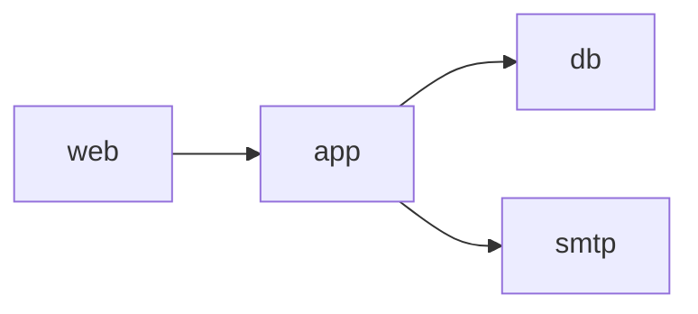

# Dockerローカル開発環境 概要仕様

Startify-AppのDocker Composeによるローカル開発環境について、現在のService構成、Network、Volume、Host、HTTPS、環境変数、各Applicationとの接続、およびローカル環境としての境界を定義します。

本書はDocker環境の構成と責務の正本です。初回構築、日常操作、検証、トラブルシューティングの手順は、後続で作成する `specifications/server/docker/setup-and-operations.md` へ分離する予定です。

## 1. 目的と適用範囲

`server/` は、LaravelとWordPressをローカルで実行するための共通Backend環境を提供します。

- NginxによるHTTP・HTTPS受付
- PHP-FPMによるLaravel・WordPress・診断Scriptの実行
- MariaDBによるLaravel・WordPressのData保存
- Mailpitによるローカルメール送受信
- mkcertで発行したローカル証明書によるHTTPS

Next.js、Astro、Vite、StorybookなどのNode.js開発Serverは、このCompose構成へ含めません。各FrontendはHost OS上で個別に起動し、必要に応じてLaravel APIへ接続します。

このDocker構成はローカル開発専用です。本番またはStagingのContainer構成、Secret管理、監視、Backup、可用性、Scaling、Deploymentは定義しません。

## 2. Compose Service

`server/docker-compose.yml` は次の4Serviceを定義します。

| Service | Container | 主な役割 | 公開Port |
| --- | --- | --- | --- |
| `web` | `${APP_NAME}_web` | Nginx、Host別Routing、HTTPS、PHP-FPMへの転送 | `80`、`443` |
| `app` | `${APP_NAME}_app` | PHP-FPM、Composer、WP-CLI、PHP Extension、Mailpit Sendmail Client | Hostへの直接公開なし、Container内`9000` |
| `db` | `${APP_NAME}_db` | Laravel・WordPress共通のMariaDB Server | `3306` |
| `smtp` | `${APP_NAME}_smtp` | SMTP受信とMailpit Web UI | `1025`、`8025` |

Image名とContainer名には `APP_NAME` を使用します。Compose Project名は `COMPOSE_PROJECT_NAME` で指定します。

### 2.1 現在のImage指定

| Service・Tool | 現在の指定 | 監査時の実行Version |
| --- | --- | --- |
| Nginx | `nginx:1.25.0` | 1.25.0 |
| PHP-FPM | `php:8.3-fpm` | 8.3.33 |
| MariaDB | `mariadb:11.0` | 11.0.6 |
| Mailpit Service | `axllent/mailpit:latest` | 1.30.7 |
| Composer | `composer:latest` からBinaryをCopy | 2.10.2 |
| WP-CLI | GitHub上のPHARを取得 | 2.12.0 |
| app内Mailpit | `develop` BranchのInstall Scriptで導入 | 1.30.7 |

Tagや取得元がVersionを完全に固定していない対象があります。現在動作中のVersionへの固定はIssue #36で管理します。仕様変更後は、この表をDockerfileと実行結果に合わせて更新します。

## 3. Service依存関係とNetwork

現在の依存関係は次のとおりです。



- `web` はFastCGIの接続先として `app:9000` を使用する
- `app` はDatabase Hostとして `db:3306` を使用する
- `app` はSMTP Hostとして `smtp:1025` を使用する
- 4ServiceはBridge Network `app-network` に参加する
- Compose Network内ではService名をHost名として解決する

`web` には現在 `links: app` も定義されていますが、同じCompose Network上のService名解決も使用できます。本書では現在設定として記録し、削除方針までは定めません。

### 3.1 起動順と準備完了

`depends_on` はServiceの起動順を制御しますが、MariaDBやPHP-FPMが接続可能になるまでの準備完了を保証しません。

現在、Composeで明示的なHealth Checkを定義していません。Mailpitだけは使用ImageのHealth Checkにより状態を確認できます。Laravel MigrationやWordPress SetupはContainer起動時に自動実行せず、起動後に手動で行います。

起動直後にDatabase接続へ失敗した場合は、Container状態とMariaDBの起動完了を確認してから処理を再実行します。CIなどで自動構築が必要になった場合は、Health Checkと待機処理を別途設計します。

## 4. Volumeと永続化

| Service | Host側 | Container側 | 用途 |
| --- | --- | --- | --- |
| `web` | `server/docker/nginx/nginx.conf` | `/etc/nginx/nginx.conf` | Nginx設定 |
| `web` | `backend/` | `/var/www/html` | Document RootとApplication Code |
| `web` | `server/docker/nginx/certs/` | `/etc/nginx/certs:ro` | ローカル証明書 |
| `app` | `backend/` | `/var/www/html` | Laravel、WordPress、診断Script |
| `app` | `server/docker/php/php.ini` | `/usr/local/etc/php/php.ini` | PHP設定 |
| `db` | `db-store` | `/var/lib/mysql` | MariaDB Data |
| `db` | `server/docker/mysql/my.cnf` | `/etc/mysql/my.cnf` | MariaDB設定 |

Named Volume `db-store` の実体名は `${APP_NAME}_store` です。通常の `docker compose down` ではDataを維持します。`make destroy` はVolumeも削除するため、Database Dataを復元できる前提がない限り実行しません。

LaravelとWordPressのSource、`.env`、Upload FileなどはBind Mountされた `backend/` 側へ保存されます。Git管理対象かどうかは各Applicationの `.gitignore` に従います。

MailpitにはVolumeを設定していません。受信メールはローカルでの動作確認に使用する一時データであり、`smtp` Containerを再作成すると失われます。

## 5. HostとDocument Root

NginxはHostごとにDocument Rootを分けます。

| URL | Document Root | 用途 |
| --- | --- | --- |
| `https://localhost` | `backend/_webroot/` | Laravel MPA |
| `https://api.localhost` | `backend/_webroot/` | 同じLaravel ApplicationのJSON API |
| `https://cms.localhost` | `backend/_cms-webroot/` | WordPress |
| `https://testing.localhost` | `backend/_testing-webroot/` | PHP・SMTP・Static Previewのローカル診断 |
| `http://localhost:8025` | Mailpit Service | Mailpit Web UI |

`localhost` と `api.localhost` は同じLaravel Entry Pointを使用します。API専用の別PHP Applicationや別Containerはありません。

### 5.1 Laravel Entry Point

`backend/_webroot/index.php` は、Document Root外にある次のLaravel Fileを読み込みます。

- `backend/laravel/vendor/autoload.php`
- `backend/laravel/bootstrap/app.php`
- `backend/laravel/storage/framework/maintenance.php`

Laravelの公開Storageは、Container内で次のSymbolic Linkを使用します。

```text
/var/www/html/_webroot/storage
  → /var/www/html/laravel/storage/app/public
```

### 5.2 WordPress Entry Point

`backend/_cms-webroot/index.php` は、`backend/_cms-webroot/wordpress` を経由してWordPressを読み込みます。

現在のSymbolic Linkは次のとおりです。

```text
backend/_cms-webroot/wordpress
  → ../wordpress
```

WordPressのHome URLは `https://cms.localhost`、Coreを配置するSite URLは `https://cms.localhost/wordpress` です。

## 6. NginxとローカルHTTPS

Nginxは次の共通TLS設定を使用します。

- TLS 1.2とTLS 1.3
- Shared SSL Session Cache
- 4Host共通のSAN証明書
- HTTP Port 80から同じHostのHTTPSへ301 Redirect
- HSTSなし
- `client_max_body_size 64M`

証明書は、mkcertで次のHostを含めて発行します。

- `localhost`
- `cms.localhost`
- `testing.localhost`
- `api.localhost`

現在のNginx設定は次の固定File名を参照します。

```text
/etc/nginx/certs/localhost+3.pem
/etc/nginx/certs/localhost+3-key.pem
```

Host数や生成順序を変更して異なるFile名になった場合は、Nginx設定とMount先を一致させます。証明書と秘密鍵はGit管理対象外で、`server/docker/nginx/certs/.gitkeep` だけを追跡します。

## 7. PHP-FPM

PHP Imageは現在、主に次を提供します。

- PHP-FPM 8.3系
- Composer
- WP-CLI
- Mailpit Sendmail Client
- LaravelとWordPressに必要なPHP Extension

現在有効な主要Extensionは次のとおりです。

- `bcmath`
- `curl`
- `fileinfo`
- `gd`
- `intl`
- `mbstring`
- `mysqli`
- `pdo_mysql`
- `openssl`
- `sodium`
- `zip`
- `OPcache`

`server/docker/php/php.ini` はローカル開発向けにError表示を有効にし、Timezoneを `Asia/Tokyo`、Memory Limitを256MB、UploadとPOSTの上限を64MBに設定します。

PHPの `mail()` は、追加のMailpit設定により `smtp:1025` へ配送します。LaravelのNotificationはLaravelのMail設定を使用し、同じSMTP Serviceへ接続します。

## 8. MariaDB

MariaDBはLaravel用DatabaseとWordPress用Databaseを同じServer内で管理します。

| 項目 | 現在の設定 |
| --- | --- |
| Bind Address | `0.0.0.0` |
| Port | `3306` |
| Character Set | `utf8mb4` |
| Collation | `utf8mb4_unicode_ci` |
| Timezone | `Asia/Tokyo` |
| Max Connections | 100 |
| Slow Query | 2秒以上を記録 |

Laravel用DatabaseはCompose起動時のMariaDB初期化変数で作成します。この初期化処理は `db-store` が空の初回起動時に実行されるため、既存Volumeがある状態で `server/.env` のDatabase名、User名、Passwordを変更しても既存DatabaseやUserへ自動反映されません。WordPress用DatabaseはWP-CLI Setupの前にMakeコマンドから作成し、同じDatabase Userへ権限を付与します。

MariaDB Dockerfileには現在、未定義のBuild時変数を参照する `ENV` が存在します。実行中Containerの値はComposeから渡されており、Dockerfile側の空値は使用していません。この整理はIssue #37で管理します。

## 9. Mailpit

Mailpitは外部へメールを配送せず、ローカル開発中のメールを受信・表示します。

| Port | 用途 |
| --- | --- |
| `1025` | SMTP |
| `8025` | Web UI |

PHPの `mail()`、Laravel Notification、WordPressからのメール確認に共通利用します。本番のSMTP Server、配信Service、認証方式、配送監視はこの構成に含みません。

## 10. 環境変数の責務

### 10.1 `server/.env`

`server/.env` はComposeとMakefileが使用するローカル固有の実値を保持します。Git管理対象外です。

Composeの `env_file` により、`server/.env` の全変数は `app` Containerへ渡されます。Database接続情報だけでなくWordPress管理者情報などもContainerの環境変数に含まれるため、診断PageやProcess情報を外部へ公開しません。

主な変数群は次のとおりです。

| 分類 | 変数 |
| --- | --- |
| Compose | `COMPOSE_PROJECT_NAME`、`APP_NAME` |
| Laravel Database | `DB_HOST`、`DB_PORT`、`DB_DATABASE`、`DB_USERNAME`、`DB_PASSWORD` |
| WordPress Database | `WP_DATABASE`、`WP_DATABASE_USERNAME`、`WP_DATABASE_PASSWORD`、`WP_DATABASE_CHARSET`、`WP_TABLE_PREFIX` |
| WordPress管理者 | `WP_ADMIN_USERNAME`、`WP_ADMIN_PASSWORD`、`WP_ADMIN_EMAIL` |
| WordPress URL | `WP_SITEURL`、`WP_HOME` |
| WordPress Debug | `WP_DEBUG`、`WP_DEBUG_LOG`、`WP_DEBUG_DISPLAY` |

`server/.env.example` は必要な変数名とローカル開発用Sampleを示します。Sample値を本番の認証情報として使用しません。

現在のMakefileは `WP_TABLE_PREFIX`、`WP_DEBUG`、`WP_DEBUG_LOG`、`WP_DEBUG_DISPLAY` をWordPress設定へ渡していません。Table PrefixはWP-CLIの既定値 `wp_`、`WP_DEBUG` は現在の `wp-config.php` で `false` です。Sample値を変更しても自動反映されないこの不一致は、Docker仕様書の作成過程で対応要否を確認します。

### 10.2 Laravel `.env`

`backend/laravel/.env` はLaravel固有の設定を保持し、Git管理対象外です。`.env.example` は、Containerへ渡された `APP_NAME` やDatabase変数を参照し、Database HostとしてCompose Service名 `db` を使用します。

現在の `make laravel-keygen` は `.env.example` を `.env` へ無条件でCopyするため、再実行すると既存設定とAPP_KEYを上書きします。初回自動生成を維持しつつ既存設定を保護する改善はIssue #38で管理します。

## 11. 秘密情報とGit管理

次はGit管理対象へ追加しません。

- `server/.env`
- `backend/laravel/.env`
- `backend/wordpress/wp-config.php`
- mkcertの証明書と秘密鍵
- LaravelのJWT秘密鍵・公開鍵
- Laravel Storage Link
- WordPress CoreへのSymbolic Link
- Database VolumeのData

DockerfileにはPassword、API Key、Tokenなどの環境依存の秘密値を保存しません。環境によらない非秘密の定数的な設定は、必要に応じてDockerfileへ定義できます。

## 12. 診断用Host

`testing.localhost` はローカル開発専用です。

| Path | 用途 | 副作用・注意 |
| --- | --- | --- |
| `/testing-app.php` | `phpinfo()` によるPHP設定・Extension確認 | 環境変数を含む情報を表示する可能性がある |
| `/testing-smtp.php` | PHP `mail()` からMailpitへの送信確認 | GET Accessでテストメールを送信する |
| `/preview/` | Static HTML Preview用Directory | Root Indexは現在存在しない |

`https://testing.localhost/` のRootは現在403を返します。診断Pageは個別PathへAccessします。

ローカルと本番でPasswordや認証情報を共有せず、`server/.env` には開発専用またはDummyの値だけを設定します。このDocker構成をStaging・本番へ転用する場合は、診断用Server Blockと診断Fileを公開対象から除外します。

## 13. ローカル環境と本番環境の境界

現在構成には、ローカル開発を優先した次の設定があります。

- PHP ErrorとStartup Errorの画面表示
- `APP_DEBUG=true`
- 開発用Database認証情報
- mkcertのローカルCAと証明書
- Mailpit
- `phpinfo()` とSMTP診断Page
- Nginx、MariaDB、Mailpit PortのHost公開
- Source CodeのBind Mount
- Nginx、PHP-FPM、MariaDBのHealth Checkなし
- Containerの自動再起動Policyなし

ComposeのPortは `HOST_PORT:CONTAINER_PORT` の短縮形式で定義しており、HostのLoopback Addressに限定していません。信頼できないNetworkへ接続している環境では、Host Firewallなども含めて公開範囲を確認します。

これらを本番要件として採用しません。本番構成ではSecret管理、TLS証明書、Error表示、Log、Security Header、Network公開範囲、Backup、監視、Health Check、再起動、Deploymentを別途設計します。

## 14. 現在の制約と既知の課題

| Issue・状態 | 内容 |
| --- | --- |
| [#36](https://github.com/DesignSupply/startify-app/issues/36) | Docker ImageとBuild中に取得する外部ToolのVersionが固定されていない |
| [#37](https://github.com/DesignSupply/startify-app/issues/37) | MariaDB Dockerfileに未定義のBuild時変数と秘密値用 `ENV` がある |
| [#38](https://github.com/DesignSupply/startify-app/issues/38) | Laravel環境変数の初期生成が既存 `.env` とAPP_KEYを上書きする |
| Issue化なし | `depends_on` はServiceの準備完了を保証せず、Mailpit以外にHealth Checkを明示していない |
| Issue化なし | 診断Pageはローカル専用で、環境変数表示またはメール送信の副作用がある |
| Issue化なし | Docker環境を検証するGitHub Actions Workflowは存在しない |
| 要確認 | `server/.env.example` のWordPress Table Prefix・Debug変数を現在のSetup Commandが使用しない |

Issue解決時は実装だけでなく、本書のImage、環境変数、制約、検証方針も現在状態へ更新します。

## 15. 検証の観点

構成変更時は、変更範囲に応じて次を確認します。

- Compose設定を解決できる
- 対象Dockerfileの静的チェックが成功する
- 4Serviceが起動する
- Nginx設定の構文が正しい
- Laravel MPAとAPIへHTTPSで接続できる
- WordPressへHTTPSで接続できる
- MariaDBへLaravelとWordPressから接続できる
- MariaDBのDataが通常の停止・起動後も保持される
- MailpitのSMTPとWeb UIを利用できる
- Certificate、`.env`、JWT鍵がGit管理対象外である
- Symbolic LinkがContainer内の正しいPathを参照する

具体的なCommand、初回構築、日常操作、破棄時の注意は、後続で作成する `specifications/server/docker/setup-and-operations.md` へ分離します。

## 16. 移行元資料

本書は、次の既存資料から設計意図を確認し、現在のCompose、Dockerfile、Nginx、PHP、MariaDB、Mailpit、Makefile、Application設定、Git管理状態、起動中Containerと照合して再構成しています。

- `.cursor/rules/env-overview.mdc`
- `specifications/server/docker/TASKS.md`
- `specifications/server/docker/TASK_001.md`
- `specifications/server/docker/TASK_002.md`
- `specifications/server/docker/TASK_003.md`
- `specifications/server/docker/TASK_004.md`

これらはドキュメント移行が完了するまで設計意図の確認に使用しますが、Dockerローカル環境の現在仕様としては本書、関連する現在仕様、現在の実装を優先します。
